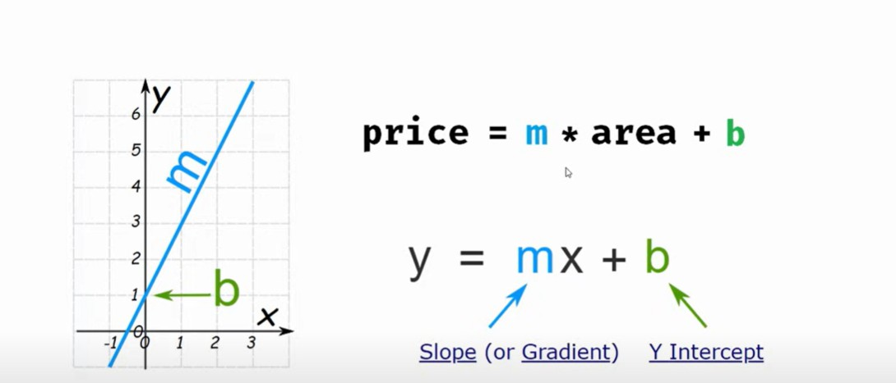

# Linear Regression:
Linear Regression is a statistical method used to model the relationship between a dependent variable and one or more independent variable.

Linear regression is also type of supervised machine learning algorithm that learns from the labelled datasets and maps the datapoints with most optimized linear functions which can be used for prediction on new datasets.

It computes the linear relationshop between the dependent variable and one or more independent features by fitting a linear equation with observed data. It predicts the continuous output variables based on the independent input variable.

## Example:

Determining the house price based on various factors like house age, distance from main road, location , area of plot, number of room.

## Best fit line:
The primary objective when using linear regression is to locate the best fit line which implies the error between predicted and actual line should be minimum. There will be least error in the best fit line.

The best fit line equation provides a straight line that represents the relationship between the dependent and independent variables.

y = mx +b

where x is independent variable

y is dependent variable of the response variable for the given value of x

b is the intercept which refers to the predicted value of the dependent variable(Y) when all the independent variables(X) are equal to zero.

m is the slope, the amount by which y changes for every unit increase of x.

## Types of Linear regression:

### Simple Linear Regression:
* Simplest form of Linear regression involving one independent variable and one dependent variable. 

#### Use cases:
* determining student height based on age.
* effect of temperature on icecream sales.
* relationship between study time and test scores.

### Multiple linear regression:

* Statistical method that uses multiple independent variables to predict the value of dependent variable.

The equation is 

y = b + m~1~x~1 +m~2~x~2 ....+ m~n~x~n

y: dependent variable
x~1, x~2, ...x~n : Independent variables
b : Intercept
m~1, m~2..m~n : slopes

### Use cases:
* Predicting agricultural yield based on rainfall, temperature, soil quality, fertilizer usage.
* predicting sales based on product price, market promotions and seasonal trends.

