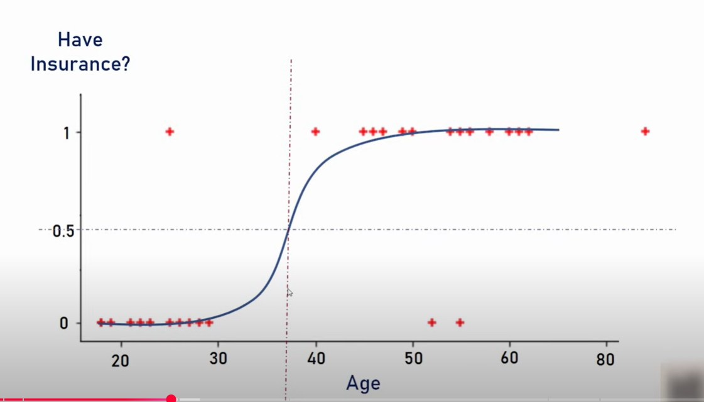

# Logistic Regression:
Logistic Regression is a supervised machine learning algorithm used for classification tasks where the goal is to predict the probability that the instance belongs to given class or not.

It can be used for binary classification where we use the sigmoid function, that takes the input as independent varible and produces the probability value of 0 and 1.

For example, we have two classes class 0 and class 1 , if value of logistic function for the input is greater than 0.5, then it belongs to class 1, else it belongs to class 0.

The below logistic classfication uses sigmoid function, shows the user have insurance or not based on age.

The S form curve is called Sigmoid function or logistic function.

It is referred to as regression because it is an extension of linear regression and used for classification problems.

## Types of Logistic Regression:

* Binomial: In binomial Logistic Regression, there can be only two possible types of dependent variables, such as 0 or 1, Pass or fail.

* Multinomial: There can be 3 or more possible ** unordered ** types of the dependent variables, such as classification of animals to cat, dog and sheep.

* Ordinal: There can be 3 or more possible ** ordered ** types of dependent variables such as low, medium, high

## Use cases:
### Email Spam detection:

To determine the email is spam or not based on factors like sender address, content of email body/header, destination etc.,

### Employee getting promotion or not:

To determine employee getting promotion or not based on the ratings, experience in current role.

