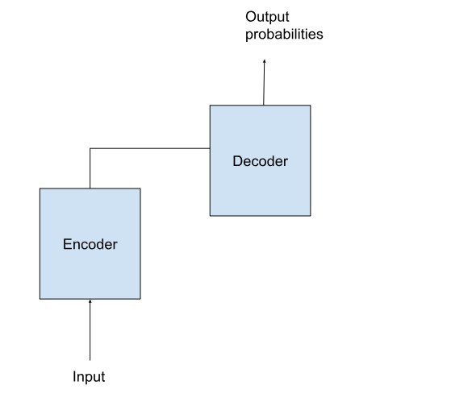

# Large language Model

## Introduction to LLM:

A Large language Model(LLM) is a deep learning algorithm that can perform a variety of Natural Language Processing(NLP) tasks. Large language models use transformer models and are trained using massive datasets. This enables them to recognize, translate, predict and generate other contents like text, image,and video.

Example: The GPT 4 model was trained on massive amounts of text data from the internet. This includes books, articles,websites and other sources. During the training process, the model learns the statistical relationships between the words, phrases and sentences, allowing it to generate the coherent and contextual relevant responses when given a prompt or query.

There are multiple large language models developed, including GPT 3, GPT 4 from Open AI, LLAMA from meta and PaLM2 from Google. These are the models that can understand language and can generate text.

The large language model is based on transformer architecture.
LLMs capture the long range dependencies between the words, hence the models can understand the context.
Large Language models generate text based on previously generated tokens.

## How Large Language models work?

The large language models are trained using unsupervised learning. With unsupervised learning, models can find previously unknown patterns in data using unlabelled data sets. This also eliminates the need for extensive data labeling, which was one of the biggest challenges in building AI models.

With the extensive training process, the LLM models don't need to be trained for any specific task and can instead serve multiple use cases.

The ability for the foundation model to generate text for a wide variety of purposes without much instruction or training is called zero shot learning. Different variations of this capability include one shot or few shot learning, where in the foundation model is fed one or few examples illustrating how a task can be accomplished to understand and better perform on select use cases.

To deploy the model to specific use cases, the models can be customized using several techniques to achieve higher accuracy. Some techniques include prompt tuning, fine tuning and adapters.

There are several classes of language models that are suited for different types of use cases.

### Encoder only:

These models that are suited for tasks that can understand language such as classification and sentiment analysis. Examples of encoder only models include BERT(Bidirectional Encoder Representations from Transformers).

### Decoder only:

This class of models are extremely good at generating language and content. Some use cases include story writing and blog generation. Examples of decoder only architecture are GPT 3(Generative Pretrained Transformers 3).

### Encoder - Decoder:

These models combine the encoder and decoder components of the transformer architecture to both understand and generate content. Some use cases include translation and summarization. Examples of this architecture include T5(Text to text Transformer).

## Architecture of Large Language Models(LLMs):

Large language models represent a class of deep learning architecture called transformer networks. A transformer model is a neural network that learns context and meaning by tracking relationships in sequential data like words in a sequence.

A transformer is made up of multiple transformer blocks known as layers. For example, a transformer has self attention layers, feed forward layers and normalization layers, all working together to decipher input to predict streams of output at inference.

The layers can be stacked to make deeper transformers and powerful language models.

There are two features that make transformers adept for large language models.

- Positional encodings
- Self-attention

Positional encoding describes the location or position of an entity in a sequence, so that position is assigned a unique representation. Transformers use a smart positional encoding scheme, where each position/index is mapped to a vector. Hence, the output of the positional encoding layer is a matrix, where each row of the matrix represents the encoded object of the sequence summed with its positional information.

Self attention assigns a weight to each part of the input data when processing it. This weight signifies the importance of that input in the context to the rest of the input. In other words, models no longer have to dedicate the same attention to all inputs and focus on the parts of the input that actually matter. The representation of what parts of the neural network needs to pay attention is learnt over time as the model shifts and analyzes mountains of data.

These two techniques, in conjunction, allow for analyzing the subtle ways and context in which distinct elements influence and relate to each other over long distances, non sequentially. The ability to process the data non-sequentially enables the decomposition of the complex problem into multiple smaller simultaneous computations.

## Large Language Model examples:

Broadly LLM use cases for text based content can be divided up in the following manner.

Generation(eg story writing, market content creation)
Summarization(eg legal paraphrasing, meeting notes summarization)
Translation(eg between languages, text to code)
Classification(eg sentiment analysis, image classification)
Chatbot(eg open domain Q&A assistants)

## Challenges:

- Compute, cost and time intensive workload
- Scale of data required
- Technical expertise.
