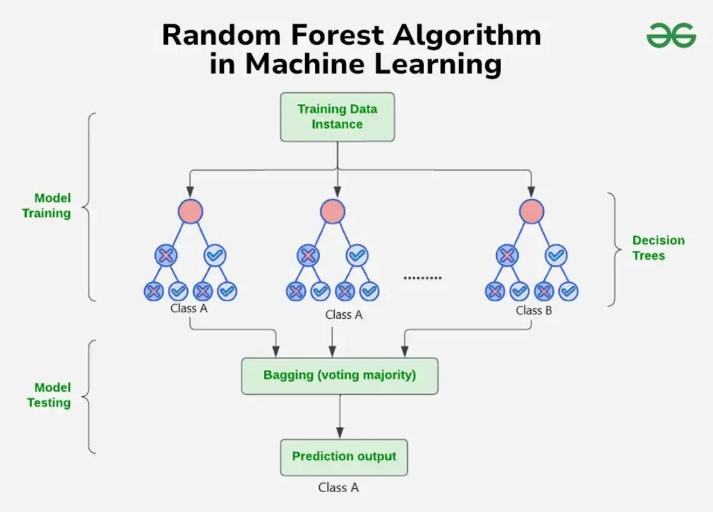

# Random Forest Algorithm:

The random forest algorithm is a machine learning algorithm that combines the results of multiple decision trees to reach a single prediction. It's a supervised learning algorithm that's used to solve classification and regression problems. This approach helps improve the accuracy of predictions. Random Forest is based on ensemble learning.

Ensemble learning refers to the approach of combining multiple ML models to produce a more accurate and robust prediction compared to any individual model

Here are some key features of the random forest algorithm:

* Ensemble learning: The random forest algorithm is based on ensemble learning, which is the process of combining multiple classifiers to improve model performance. 

* Decision trees: Each decision tree in the random forest is trained with a specific random noise. The trees are built on different subsets of the same data set, which leads to different leaves.

* Majority voting: The random forest algorithm takes the average of the results from each decision tree to make a final prediction. This is based on the majority votes of the predictions. 

* Accuracy: The accuracy of the random forest algorithm increases with the number of trees in the forest. 

* Ease of use: The random forest algorithm is easy to use and flexible. 

* Prevents overfitting: The random forest algorithm prevents overfitting of data. 

## Example:

Imagine asking a group of friends for advice on where to go for vacation. Each friend gives their recommendation based on their unique perspective and preferences (decision trees trained on different subsets of data). You then make your final decision by considering the majority opinion or averaging their suggestions (ensemble prediction).

## Key Features of Random Forest
* Handles Missing Data: Automatically handles missing values during training, eliminating the need for manual imputation.
* Algorithm ranks features based on their importance in making predictions offering valuable insights for feature selection and interpretability.
* Scales Well with Large and Complex Data without significant performance degradation.
* Algorithm is versatile and can be applied to both classification tasks (e.g., predicting categories) and regression tasks (e.g., predicting continuous values).

## How Random Forest Algorithm Works?
The random Forest algorithm works in several steps:

* Random Forest builds multiple decision trees using random samples of the data. Each tree is trained on a different subset of the data which makes each tree unique.
* When creating each tree the algorithm randomly selects a subset of features or variables to split the data rather than using all available features at a time. This adds diversity to the trees.
* Each decision tree in the forest makes a prediction based on the data it was trained on. When making final prediction random forest combines the results from all the trees.
* For classification tasks the final prediction is decided by a majority vote. This means that the category predicted by most trees is the final prediction.
* For regression tasks the final prediction is the average of the predictions from all the trees.
* The randomness in data samples and feature selection helps to prevent the model from overfitting making the predictions more accurate and reliable.
