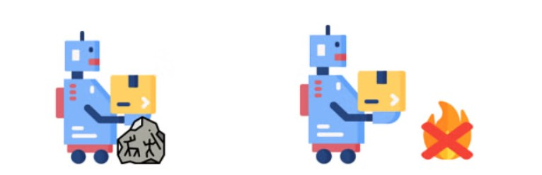
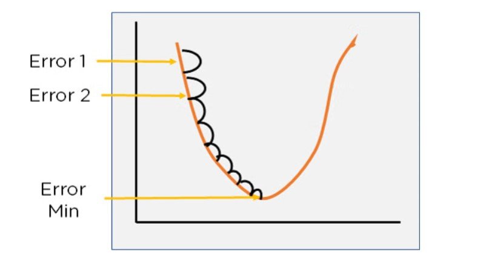
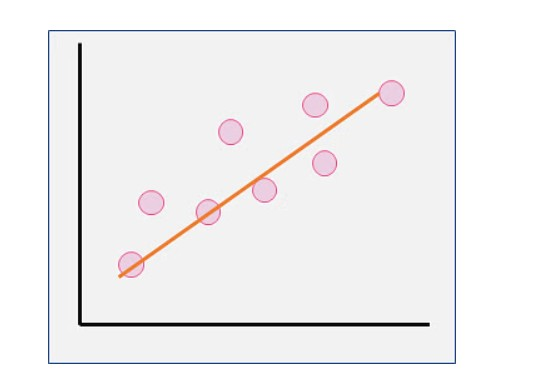

# Cost Function:
A Cost Function is used to measure just how wrong the model is in finding a relation between the input and output. It tells you how badly your model is behaving/predicting

Consider a robot trained to stack boxes in a factory. The robot might have to consider certain changeable parameters, called Variables, which influence how it performs. Let’s say the robot comes across an obstacle, like a rock. The robot might bump into the rock and realize that it is not the correct action. 

It will learn from this, and next time it will learn to avoid rocks. Hence, your machine uses variables to better fit the data. The outcome of all these obstacles will further optimize the robot and help it perform better. It will generalize and learn to avoid obstacles in general, say like a fire that might have broken out. The outcome acts as a cost function, which helps you optimize the variable, to get the best variables and fit for the model.

# Gradient Descent
Gradient Descent is an algorithm that is used to optimize the cost function or the error of the model. It is used to find the minimum value of error possible in your model.

Gradient Descent can be thought of as the direction you have to take to reach the least possible error. The error in your model can be different at different points, and you have to find the quickest way to minimize it, to prevent resource wastage.

Gradient Descent can be visualized as a ball rolling down a hill. Here, the ball will roll to the lowest point on the hill. It can take this point as the point where the error is least as for any model, the error will be minimum at one point and will increase again after that.

Simple analogy: Imagine you're blindfolded on a hilly landscape and want to find the lowest point. Gradient descent is like feeling around to find the direction with the steepest downhill slope and taking a step in that direction repeatedly until you reach the bottom. 

In gradient descent, you find the error in your model for different values of input variables. This is repeated, and soon you see that the error values keep getting smaller and smaller. Soon you’ll arrive at the values for variables when the error is the least, and the cost function is optimized.

## What Is the Cost Function For Linear Regression?
A Linear Regression model uses a straight line to fit the model. This is done using the equation for a straight line as shown : 

 Output = a* Input +b

In the equation, you can see that two entities can have changeable values (variable) a, which is the point at which the line intercepts the x-axis, and b, which is how steep the line will be, or slope.

At first, if the variables are not properly optimized, you get a line that might not properly fit the model. As you optimize the values of the model, for some variables, you will get the perfect fit. The perfect fit will be a straight line running through most of the data points while ignoring the noise and outliers. A properly fit Linear Regression model looks as shown below :        

For the Linear regression model, the cost function will be the minimum of the Root Mean Squared Error of the model, obtained by subtracting the predicted values from actual values. The cost function will be the minimum of these error values.

Hence Gradient Descent is an algorithm that finds the best fit line for the given training data set.

