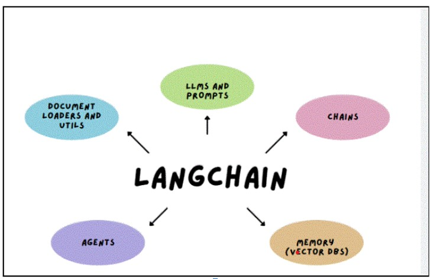
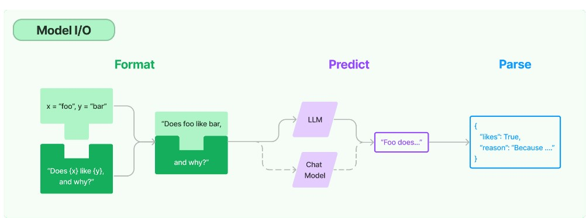
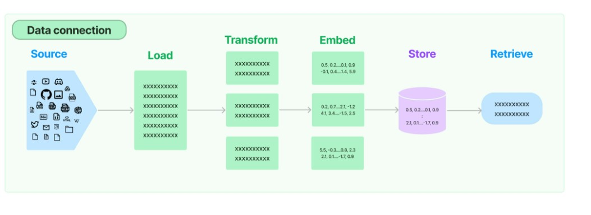
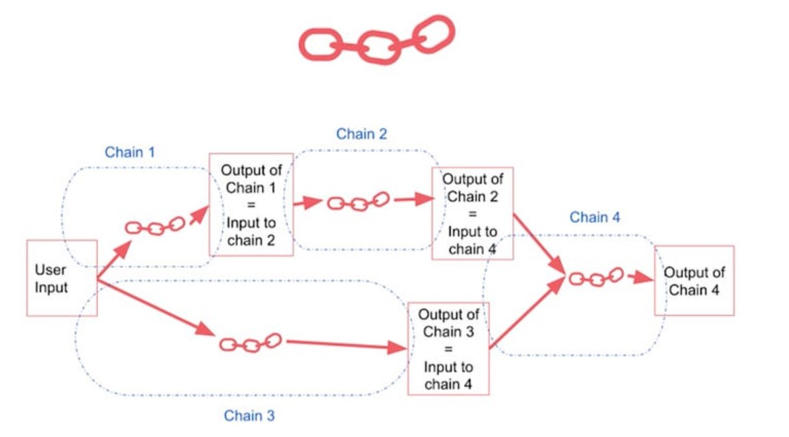
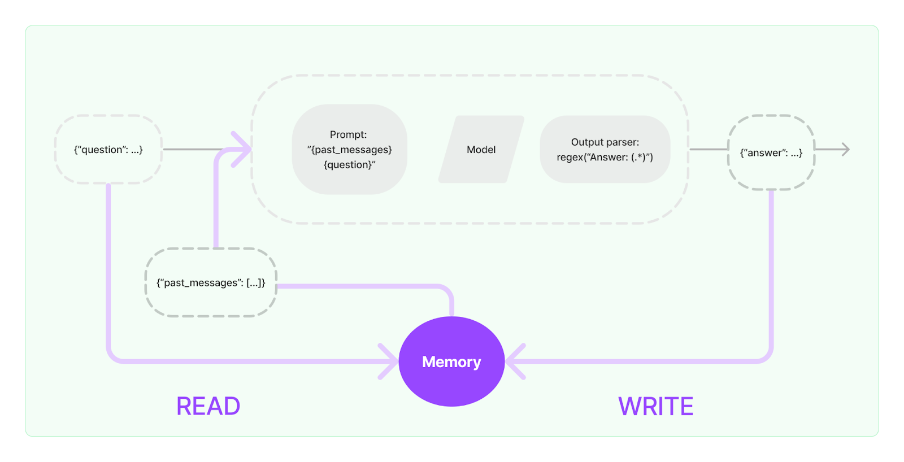

# LangChain Concepts

Langchain is an open-source framework that facilitates the creation of large language model (LLM) based applications and chatbots. It provides a standard interface for interacting with LLMs, as well as a number of features that make it easier to build complex applications.

 LangChain comprises of several tools that make it very easy to work with Large Language models – the LLM could be ChatGPT, Hugging Face LLM, etc. These components include:

 

## Model I/O
The core element of any language model application is...the model. LangChain gives you the building blocks to interface with any language model.
 

### LLMChain
In Langchain, the LLMChain, or the Language Model (LM) Chain, is a principal element. It is designed to connect a series of components and chains that form a pathway through which data and tasks flow within the AI system. This facilitates a dynamic interaction between different elements of the system, culminating in the execution of the task at hand.

The LLMChain can be visualized as an assembly line in a factory, where different workstations, representing the components, are meticulously linked. Each station performs its specific function, passing on the result to the next in line, thus efficiently accomplishing the overall task.

### Prompt Selector
The Prompt Selector acts as a critical guiding force within the LLMChain, dictating the direction of a conversation based on a specific context. It curates appropriate prompts to evoke meaningful responses from the language model, thus creating an interactive conversational flow.
Imagine the Prompt Selector as a proficient chess player, diligently planning each move, foreseeing the potential responses, and thus shaping the course of the game. It sifts through various prompts, selects the most contextually suitable one, and guides the conversation toward meaningful interaction.

### Index

An ‘index’ within the context of a chain represents a specific position or stage in the sequence of components. It acts as a reference point, indicating where a particular component fits into the overall chain. This concept is essential in organizing the flow of data and tasks within the LLMChain.

Indices in a chain can be equated to milestones on a highway, indicating the progress and direction of the journey. They offer clarity on the chain’s structure, guiding the flow of tasks, and ensuring each component is correctly sequenced for optimal functionality.
Unifying Components and Chains

Let’s explore a practical scenario where these concepts come together to enable LangChain’s advanced functionality:

Consider an AI-based customer service chatbot. It employs an LLMChain that follows a path:

User Input -> Intent Recognition -> Prompt Selector -> Language Model -> Output Formatter

Here, the User Input initiates the interaction. The Intent Recognition component analyzes this input to understand the underlying user intent. The Prompt Selector then curates a suitable prompt based on this intent, guiding the conversation in the desired direction. 

The Language Model processes this prompt and formulates a raw response, which the Output Formatter finally presents as a comprehensive, human-friendly response to the user.
In this chain, the index of each component would be its position in the sequence, guiding the flow of data and tasks through the system.

### Prompts:

#### Prompt Templates:

Prompt templates serve as the foundation for structuring input prompts to LLMs. They enable data engineers to format prompts in different ways to obtain diverse results. For instance, in question-answering applications, prompts can be tailored to conventional Q&A formats, bullet lists of answers, or even problem summaries related to the given question.

Creating prompt templates in Langchain is straightforward. The library provides the PromptTemplate class, which allows you to define templates with placeholders for input variables.

from langchain import PromptTemplate

template = """
Question: {question}

Answer: 
"""

prompt = PromptTemplate(
    template=template,
    input_variables=['question']
)

#### Prompt Values:

In the realm of LangChain, a PromptValue is what is eventually passed to the underlying model. This concept is vital to understanding how LangChain interfaces with different AI models, particularly because different models may expect different data formats. The PromptValue class exposes methods that can be converted to the exact input types expected by each model type, such as Text or ChatMessages.

For instance, let’s consider a language translation model that translates English text to Spanish. The English text that we want to translate would be wrapped in a PromptValue object, which is then passed to the model. The model processes the PromptValue and returns the translated text as output.

#### OutputParsers: Structuring the Model Responses
Once the model has processed the PromptValue, it returns a text response. However, we often want more structured information than just text. This is where OutputParsers step in. They are responsible for instructing the model how output should be formatted and parsing the output into the desired format

Consider a scenario where we’re using a model to extract key information from a legal document. The model’s raw output might be a block of text, but an OutputParser could parse this text and extract the desired pieces of information, such as the parties involved, the contract date, and key clauses.

#### Real-World examples
let’s apply the concepts of PromptValue, PromptTemplate, ExampleSelectors, and OutputParsers to the examples of “Hiking trip to Colorado”:

* Example 1: Hiking Trip to Colorado:
  
For planning a hiking trip to Colorado, we use a travel recommendation AI model. Here’s how you could utilize the different components of LangChain:
PromptValue: The user’s preferences for the trip, such as desired difficulty level of the hike, preferred scenery (like mountains or forests), and preferred duration of the hike, would be passed as the PromptValue to the travel recommendation AI model.

PromptTemplate: This would take in the user’s inputs and dynamically construct the PromptValue. For instance, if the user specifies that they want a moderate hike in the Rocky Mountains that lasts for three days, the PromptTemplate would construct a PromptValue representing these preferences.

ExampleSelectors: If the AI model learns from examples, ExampleSelectors could be used to provide examples of ideal hiking trips based on the user’s preferences. These examples could guide the model in generating suitable recommendations.

OutputParsers: The model’s output, perhaps a list of recommended hiking trails, would be parsed by an OutputParser. The OutputParser could structure this output in a user-friendly format, such as an itinerary with details of each recommended trail, including its location, difficulty level, and unique features.

## Retrieval:

Many LLM applications require user-specific data that is not part of the model's training set. The primary way of accomplishing this is through Retrieval Augmented Generation (RAG). In this process, external data is retrieved and then passed to the LLM when doing the generation step.

LangChain provides all the building blocks for RAG applications - from simple to complex. This section of the documentation covers everything related to the retrieval step - e.g. the fetching of the data. Although this sounds simple, it can be subtly complex. This encompasses several key modules.

 

### Document loaders

Document loaders load documents from many different sources. LangChain provides over 100 different document loaders as well as integrations with other major providers in the space, like AirByte and Unstructured. LangChain provides integrations to load all types of documents (HTML, PDF, code) from all types of locations (private S3 buckets, public websites).

### Text Splitting

A key part of retrieval is fetching only the relevant parts of documents. This involves several transformation steps to prepare the documents for retrieval. One of the primary ones here is splitting (or chunking) a large document into smaller chunks. LangChain provides several transformation algorithms for doing this, as well as logic optimized for specific document types (code, markdown, etc).

### Text embedding models

Another key part of retrieval is creating embeddings for documents. Embeddings capture the semantic meaning of the text, allowing you to quickly and efficiently find other pieces of a text that are similar. LangChain provides integrations with over 25 different embedding providers and methods, from open-source to proprietary API, allowing you to choose the one best suited for your needs. LangChain provides a standard interface, allowing you to easily swap between models.

### Vector stores

With the rise of embeddings, there has emerged a need for databases to support efficient storage and searching of these embeddings. LangChain provides integrations with over 50 different vectorstores, from open-source local ones to cloud-hosted proprietary ones, allowing you to choose the one best suited for your needs. LangChain exposes a standard interface, allowing you to easily swap between vector stores.

### Retrievers

Once the data is in the database, you still need to retrieve it. LangChain supports many different retrieval algorithms and is one of the places where we add the most value. LangChain supports basic methods that are easy to get started - namely simple semantic search. However, we have also added a collection of algorithms on top of this to increase performance. These include:

Parent Document Retriever: This allows you to create multiple embeddings per parent document, allowing you to look up smaller chunks but return larger context.
Self Query Retriever: User questions often contain a reference to something that isn't just semantic but rather expresses some logic that can best be represented as a metadata filter. Self-query allows you to parse out the semantic part of a query from other metadata filters present in the query.
Ensemble Retriever: Sometimes you may want to retrieve documents from multiple different sources, or using multiple different algorithms. The ensemble retriever allows you to easily do this.

### Indexing

The LangChain Indexing API syncs your data from any source into a vector store, helping you:

* Avoid writing duplicated content into the vector store
* Avoid re-writing unchanged content
* Avoid re-computing embeddings over unchanged content
* All of which should save you time and money, as well as improve your vector search results.

 ## Chains:

 A chain, in the context of AI, is a sequence of components linked together to accomplish a specific task. It is the step-by-step flow of data and tasks in an AI system. Taking our AI chatbot example, a simple chain might look like this:

User Input -> Language Model -> Output Formatter

In this chain, the user’s input is first processed by the Language Model component. The model generates a response based on the user’s input, which is then passed to the Output Formatter. Finally, the user sees the formatted response, marking the end of the chain. The power of chains lies in their flexibility. They can be as simple or as complex as necessary, including any number of components depending on the task at hand. By creating and combining different chains, we can build complex AI systems capable of performing a wide array of tasks.

Chains help in combining different LLM calls and actions automatically. That is: you give one prompt to the language model and the output of that prompt you want to use it as an input to another call and so on.

A sequential chain combines multiple chains where the output of one chain is the input of the next chain. It runs a sequence of chains one after another. There are 2 types of sequential chains:

SimpleSequentialChain — single input/output
SequentialChain — multiple inputs/outputs   

An LLMChain is a basic but the most commonly used type of chain. It consists of a PromptTemplate, an Open AI model (an LLM or a ChatModel), and an optional output parser. LLM chain takes multiple input variables and uses the PromptTemplate to format them into a prompt. It passes the prompt to the model. Finally, it uses the OutputParser (if provided) to parse the output of the LLM into a final format.

### SimpleSequentialChain
This is the simplest form of a sequential chain, where each step has a singular input/output, and the output of one step is the input to the next. This works well when we have subchains that expect only one input and return only one output.

### SequentialChain
All sequential chains do not involve passing a single string as an input and getting a single string as an output. More complex chains involve multiple inputs and multiple final outputs. We will be discussing this in our next example.

 

 For simple tasks, using a single LLM (Large Language Model) works well. However, for more complex tasks, it usually requires chaining multiple steps and/or models.

The legacy way of using Chains in LangChain is through the Chain interface.

The newer and recommended method is the LangChain Expression Language (LCEL). Although LCEL is preferred for new projects, the Chain method is still useful and supported.
from langchain.llms import OpenAI
from langchain.chat_models import ChatOpenAI
from langchain.prompts import ChatPromptTemplate
from langchain.schema import StrOutputParser

model = ChatOpenAI(openai_api_key = “...”)
prompt = ChatPromptTemplate.from_messages(
    [
        (
            "system",
            "You're a expert data scientist and machine learning engineer who offer its expertise and responds to the point and accurately.",
        ),
        ("human", "{question}"),
    ]
)
runnable = prompt | model | StrOutputParser()

for chunk in runnable.stream({"question": "How is machine learning different than deep learning?"}):
    print(chunk, end="", flush=True)

Output:

>>> Machine learning and deep learning are subfields of artificial intelligence (AI) that involve training models to make predictions or decisions based on data. While there is an overlap between the two, they ……..

The way runnable is created is not pretty standard for Python, but this | is a pipe operator. Prompt | model | StrOutputParser() would mean that Prompt is passed through the model, and the output of that is then passed through StrOutputParser(). Each segment in the chain transforms the data in some way.

Want to learn more about interesting use cases and applications that can be built using LangChain? Check out our Engineering and Data Application use-cases blog.

## Memory:
Memory in the context of conversational AI is the process of storing and retrieving data during a conversation. This process is typically handled in two ways:

Data Fetching: Based on the input provided, relevant pieces of data are fetched for the current context.

State Updating: Depending on the input and output, the state of the conversation is updated accordingly.

### Short-Term Memory
Short-term memory pertains to the information passing within the context of a singular conversation. This generally includes previous chat messages or summaries of them. The mechanism responsible for managing short-term memory in a conversation is often a class or a function like ChatMessageHistory.
For instance, in Langchain, the ChatMessageHistory class manages all previous chat interactions. It exposes two methods, add_user_message, and add_ai_message, which store user messages and AI responses, respectively. It also reveals a message attribute for accessing all previous messages.

### Long-Term Memory
On the other hand, long-term memory is concerned with fetching and updating information across multiple conversations. This is where more complex systems, such as vector stores, come into play.
A vector store is an index that creates numerical embeddings for each document using an Embedding Model. It stores documents and their associated embeddings and provides quick ways to look up relevant documents using these embeddings​.

### The Importance of Memory in Conversational AI
Memory is crucial in providing a coherent and relevant experience for users engaging with conversational AI. Short-term memory helps maintain context within a singular conversation, ensuring responses are directly related to the current conversation. Long-term memory, meanwhile, allows the AI to remember information across different conversations, providing a more personalized and meaningful interaction.

As we continue to advance in the field of artificial intelligence, the concept of memory in conversational AI is becoming more sophisticated, enabling more natural and context-aware conversations. By understanding these concepts, developers can leverage them to create more effective and engaging AI applications.

In language model applications that involve chatting, it's important for the system to remember past conversations.

Just like in a normal chat, the system should be able to look back at what was said before.

 

At its simplest, this means the system can see a few of the previous messages. But a more advanced system will remember more details, like facts about different topics and how they connect.

This ability to remember past chats is called "memory." LangChain helps add memory to these chat systems.

A memory in LangChain does two main things:

Before sending the query to LLM, the system reads from its memory to enhance the initial input prompt it received from the user.
Once the response is returned by LLM, it writes it to memory for future interactions, before returning the final output to the user.
To use the Memory feature in LangChain you can use the ConversationBufferMemory class.

from langchain.memory import ConversationBufferMemory
memory = ConversationBufferMemory(return_messages=True)
memory.chat_memory.add_user_message("hi!")
memory.chat_memory.add_ai_message("what's up?")
memory.chat_memory.add_user_message("how are you doing?")
memory.chat_memory.add_ai_message("I am fine, thank you and you?")

* to check the variables history
  
memory.load_memory_variables({})

{
'history': [HumanMessage(content='hi!'),

AIMessage(content="what's up?"),

HumanMessage(content='how are you doing?'),

AIMessage(content='I am fine, thank you and you?')]
}

It returns a dictionary where the key by default is history. This key leads to a list of messages, and these messages can be either from a human (HumanMessage) or from the LLM (AIMessage).

## Agents in LangChain and the ReAct framework:

Developers use tools and libraries that LangChain provides to compose and customize existing chains for complex applications. An agent is a special chain that prompts the language model to decide the best sequence in response to a query. When using an agent, developers provide the user's input, available tools, and possible intermediate steps to achieve the desired results. Then, the language model returns a viable sequence of actions the application can take.

Let us try and understand what “Agents” are in Language – as described in the introductory section, LangChain sits in the middle between the LLM and the external tools. Agents can be thought of “bots” which take action on behalf of yourself. They are going to chain together different actions in LangChain.

Formal definition of Agents:

Agents use an LLM to determine which action to take and in what order. An action can be either: using a tool and observing its output or returning it to the user directly – if the observed output is the answer that’s the LLM thinks is correct.

### Parameters when creating an Agent:

Following parameters are required when creating an Agent:

Tool: A tool is a function that performs a particular duty. This can be Google search, Database Lookup, other chains. The interface for a tool is currently a function that is expected to have a string as an input with a string as an output.

LLM: The language model powering the agent.
Agent: The agent to use. This should be a string that references a support agent class.

List of tools supported in LangChain:

i)  Serpapi [Complete]: A search engine. Useful when you need to answer questions about current events. Input should be a search query.

ii)   Wolfram-alpha: A wolfram-alpha search engine. Useful for scientific calculations

iii) Llm-math: Useful when you want to find answer questions about mathematics.

iv) Google-search: A wrapper around google search. Useful when you want to answer questions about current events. Input should be a search query.

v) news-api: Use this when you want to get information about the top headlines of the current news stories.

Unlike chains, where a sequence of actions is pre-determined and embedded in the code, agents employ a language model as a decision-making tool to identify the appropriate actions and their sequence.

There are three key concepts in LangChain’s Agents:

* Tools: Descriptions of available tools to LLM
* User input: The high-level objective of the task
* Intermediate steps: Any (action, tool output) pairs previously executed in order to achieve the user input

Tools represent functionalities that an agent can activate. Two crucial aspects of tool design include:

Ensuring the agent has access to appropriate tools.
Defining the tools in a manner that maximizes their usefulness to the agent.
For various routine activities, an agent requires a collection of interconnected tools. To address this, LangChain introduces the idea of toolkits. LangChain offers a broad range of toolkits to get started.