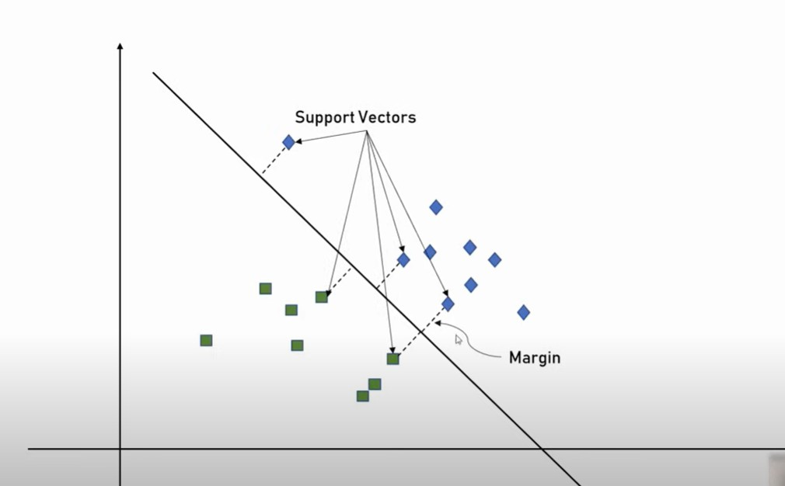
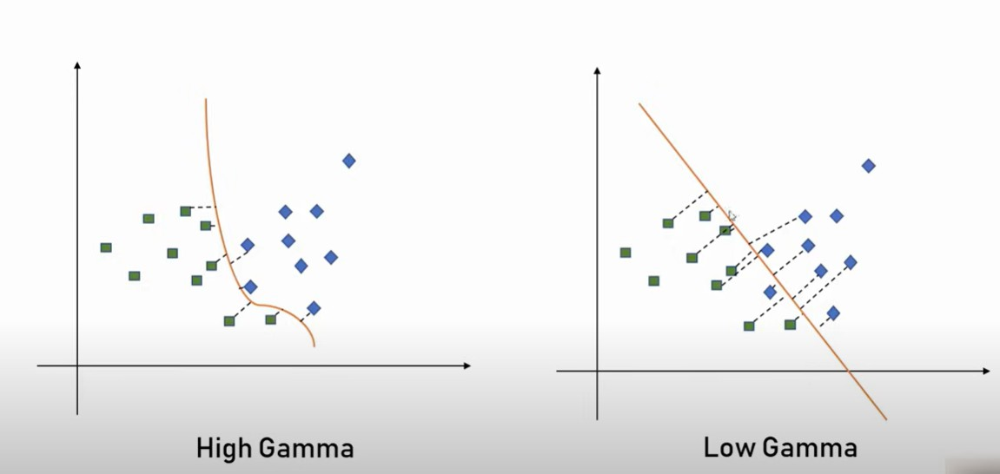
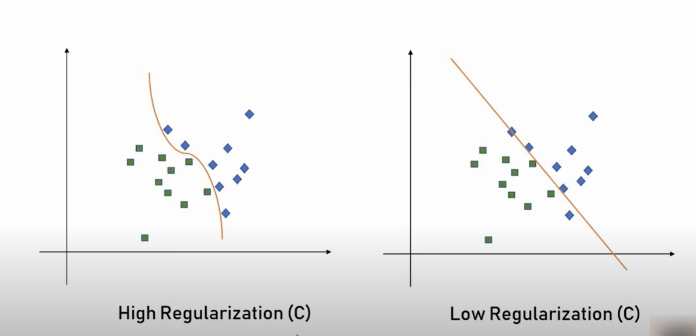
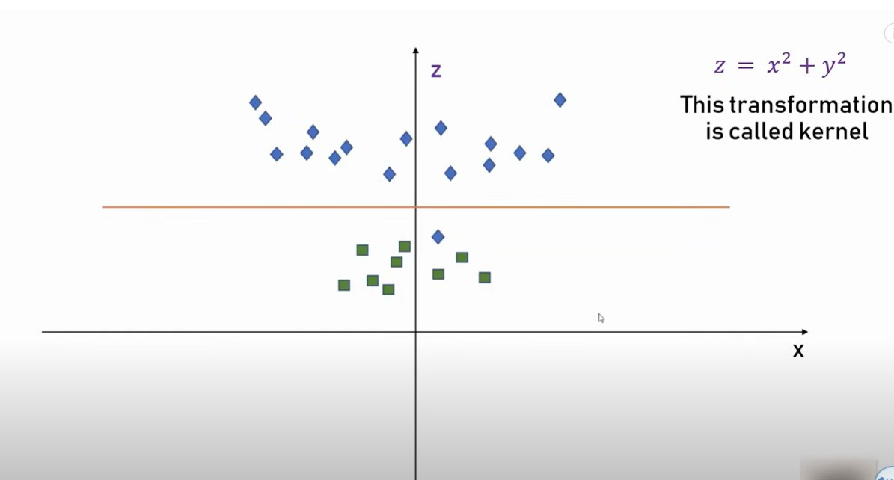

# Support Vector Machine Algorithm:

Support Vector Machine or SVM is one of the most popular Supervised Learning algorithms, which is used for Classification as well as Regression problems. However, primarily, it is used for Classification problems in Machine Learning.

The goal of the SVM algorithm is to create the best line or decision boundary that can segregate n-dimensional space into classes so that we can easily put the new data point in the correct category in the future. This best decision boundary is called a hyperplane.

SVM chooses the extreme points/vectors that help in creating the hyperplane. These extreme cases are called as support vectors, and hence algorithm is termed as Support Vector Machine. Consider the below diagram in which there are two different categories that are classified using a decision boundary or hyperplane:

The dimension of the hyperplane depends on the number of features. For instance, if there are two input features, the hyperplane is simply a line, and if there are three input features, the hyperplane becomes a 2-D plane. As the number of features increases beyond three, the complexity of visualizing the hyperplane also increases.

## Margin:

The distance between the datapoint and the hyperplane is called Margin and the data points are called support vectors.
More the distance it will be optimal.

Hence, support vector machine draws a hyper plane in n dimensional space such that it maximizes margin between the classification groups.

## Gmamma
In a support vector machine (SVM), gamma is a parameter that controls the influence of a training example on the decision boundary.

### High gamma
Only the closest points to the decision boundary are weighted, resulting in a smoother boundary

### Low gamma
Even points far away from the decision boundary are weighted, resulting in a more wiggly boundary

The choice of gamma and other parameters can significantly impact the performance of an SVM model. 

## Regularization:

The regularization parameter in a Support Vector Machine (SVM) is denoted by C and controls the trade-off between the model's complexity and its ability to classify training data correctly:

### Large C
The optimization will choose a smaller-margin hyperplane to get all the training points classified correctly. This means that misclassifications are penalized more heavily.

### Small C
The optimizer will look for a larger-margin separating hyperplane, even if that hyperplane misclassifies more points. This means that there will be more misclassifications.

## Kernel:
A "kernel parameter" in an SVM (Support Vector Machine) refers to a value that controls the behavior of the kernel function used to map data into a higher dimensional space, allowing the SVM to classify non-linearly separable data; essentially, it determines how the similarity between data points is calculated, significantly impacting the model's performance and decision boundary shape. 

### Function of the kernel:
The kernel function takes two data points as input and calculates their similarity based on the chosen kernel type (e.g., linear, polynomial, radial basis function (RBF)). 

#### Impact on classification:
By adjusting the kernel parameters, you can influence how well the SVM can separate data points belonging to different classes, especially when dealing with complex non-linear relationships. 

#### Common kernel parameters:
Gamma (in RBF kernel): Controls the influence of a single data point, with higher gamma values leading to a more localized effect. 
Degree (in polynomial kernel): Determines the power of the polynomial function used for similarity calculation. 

#### Example:
When using the RBF kernel, the "gamma" parameter is a key kernel parameter. A larger gamma value means the model will focus more on nearby data points, potentially leading to overfitting if set too high. 

### How to use gamma in SVM?
* Use a grid search to find the best combination of gamma and other parameters 
* Train an SVM with a high gamma value 
* Train an SVM with a low gamma value 
* Plot the decision boundary for each model to compare the results 

## Applications

### Image Classification
One of the most common applications of SVMs is in image classification. In this use case, the SVM algorithm is trained on a set of labeled images. The algorithm then uses this training data to classify new images. SVMs have been used for everything from recognizing faces in photographs to detecting tumors in medical images.

### Email Classification:
SVMs have been used to classify email as spam or not spam. In this application, the SVM algorithm is trained on a set of emails that are labeled as spam or not spam. The algorithm then uses this training data to classify new emails.

### Fraud Detection:
SVMs have been used to detect credit card fraud. The SVM algorithm is trained on a set of credit card transactions that are labeled as fraudulent or not fraudulent. The algorithm then uses this training data to detect new fraudulent transactions.