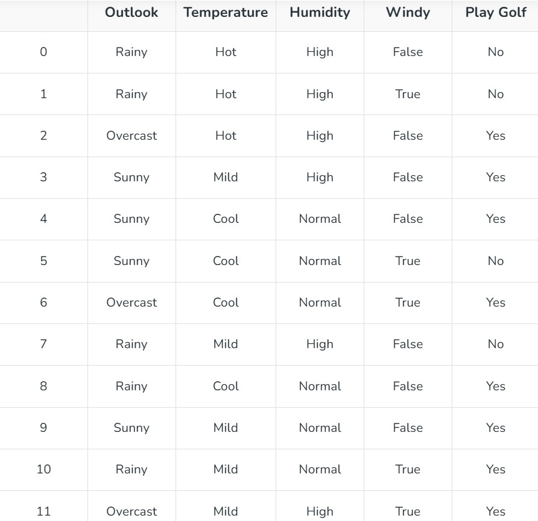
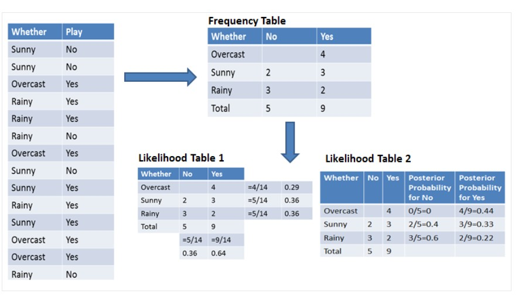

# Naive Bayes Algorithm:

Naive Bayes classifiers are supervised machine learning algorithms used for classification tasks, based on Bayes’ Theorem to find probabilities.    

## Key Features of Naive Bayes Classifiers
The main idea behind the Naive Bayes classifier is to use Bayes’ Theorem to classify data based on the probabilities of different classes given the features of the data. It is used mostly in high-dimensional text classification

The Naive Bayes Classifier is a simple probabilistic classifier and it has very few number of parameters which are used to build the ML models that can predict at a faster speed than other classification algorithms.
It is a probabilistic classifier because it assumes that one feature in the model is independent of existence of another feature. In other words, each feature contributes to the predictions with no relation between each other.
Naïve Bayes Algorithm is used in spam filtration, Sentimental analysis, classifying articles and many more.

## Why it is Called Naive Bayes?
It is named as “Naive” because it assumes the presence of one feature does not affect other features.

The “Bayes” part of the name refers to  for the basis in Bayes’ Theorem.

Consider a fictional dataset that describes the weather conditions for playing a game of golf. Given the weather conditions, each tuple classifies the conditions as fit(“Yes”) or unfit(“No”) for playing golf. Here is a tabular representation of our dataset.

The dataset is divided into two parts, namely, feature matrix and the response vector.

Feature matrix contains all the vectors(rows) of dataset in which each vector consists of the value of dependent features. In above dataset, features are ‘Outlook’, ‘Temperature’, ‘Humidity’ and ‘Windy’.
Response vector contains the value of class variable(prediction or output) for each row of feature matrix. In above dataset, the class variable name is ‘Play golf’.

## Assumption of Naive Bayes
The fundamental Naive Bayes assumption is that each feature makes an:

Feature independence: This means that when we are trying to classify something, we assume that each feature (or piece of information) in the data does not affect any other feature.

Continuous features are normally distributed: If a feature is continuous, then it is assumed to be normally distributed within each class.

Discrete features have multinomial distributions: If a feature is discrete, then it is assumed to have a multinomial distribution within each class.

Features are equally important: All features are assumed to contribute equally to the prediction of the class label.

No missing data: The data should not contain any missing values.

Understanding Bayes’ Theorem for naive bayes
Bayes’ Theorem finds the probability of an event occurring given the probability of another event that has already occurred. Bayes’ theorem is stated mathematically as the following equation:

P(A|B) = P(B|A)P(A) / P(B)

where A and B are events and P(B)!=0

P(A|B) is a conditional probability: the probability of event A occuring given that B is true. It is also called the posterior probability of A given B.

P(B|A) is also a conditional probability: the probability of event B occuring given that A is true. It can also be interpreted as the likelihood of A given a fixed B

P(A) and P(B) are  the probabilities of observing A and B respectively without any given conditions; they are known as the prior probability and marginal probability.

## Types of Naive Bayes Model
There are three types of Naive Bayes Model :

### Gaussian Naive Bayes
In Gaussian Naive Bayes, continuous values associated with each feature are assumed to be distributed according to a Gaussian distribution. A Gaussian distribution is also called Normal distribution When plotted, it gives a bell shaped curve which is symmetric about the mean of the feature values

### Multinomial Naive Bayes
Multinomial Naive Bayes is used when features represent the frequency of terms (such as word counts) in a document. It is commonly applied in text classification, where term frequencies are important.

### Bernoulli Naive Bayes
Bernoulli Naive Bayes deals with binary features, where each feature indicates whether a word appears or not in a document. It is suited for scenarios where the presence or absence of terms is more relevant than their frequency. Both models are widely used in document classification tasks

## Advantages of Naive Bayes Classifier
* Easy to implement and computationally efficient.
* Effective in cases with a large number of features.
* Performs well even with limited training data.
* It performs well in the presence of categorical features.
* For numerical features data is assumed to come from normal distributions

## Disadvantages of Naive Bayes Classifier
* Assumes that features are independent, which may not always hold in real-world data.
* Can be influenced by irrelevant attributes.
May assign zero probability to unseen events, leading to poor generalization.

## Applications of Naive Bayes Classifier
* Spam Email Filtering: Classifies emails as spam or non-spam based on features.
* Text Classification: Used in sentiment analysis, document categorization, and topic classification.
* Medical Diagnosis: Helps in predicting the likelihood of a disease based on symptoms.
* Credit Scoring: Evaluates creditworthiness of individuals for loan approval.
* Weather Prediction: Classifies weather conditions based on various factors.

## How Naive Bayes Classifier Works?
Let’s understand the working of Naive Bayes through an example. Given an example of weather conditions and playing sports. You need to calculate the probability of playing sports. Now, you need to classify whether players will play or not, based on the weather condition.

First Approach (In case of a single feature)
Naive Bayes classifier calculates the probability of an event in the following steps:

Step 1: Calculate the prior probability for given class labels
Step 2: Find Likelihood probability with each attribute for each class
Step 3: Put these value in Bayes Formula and calculate posterior probability.
Step 4: See which class has a higher probability, given the input belongs to the higher probability class.

For simplifying prior and posterior probability calculation, you can use the two tables frequency and likelihood tables. Both of these tables will help you to calculate the prior and posterior probability. The Frequency table contains the occurrence of labels for all features. There are two likelihood tables. Likelihood Table 1 is showing prior probabilities of labels and Likelihood Table 2 is showing the posterior probability.

Now suppose you want to calculate the probability of playing when the weather is overcast.

Probability of playing:
P(Yes | Overcast) = P(Overcast | Yes) P(Yes) / P (Overcast)

Calculate Prior Probabilities:
P(Overcast) = 4/14 = 0.29
P(Yes)= 9/14 = 0.64

Calculate Posterior Probabilities:
P(Overcast|Yes) = 4/9 = 0.44

Probability of not playing:
P(No|Overcast) = P(Overcast | No) P(No) / P (Overcast) 

Calculate Prior Probabilities:
P(Overcast) = 4/14 = 0.29
P(No)= 5/14 = 0.36

Calculate Posterior Probabilities:
P(Overcast |No) = 0/9 = 0

Put Prior and Posterior probabilities
P (No | Overcast) = 0 * 0.36 / 0.29 = 0

The probability of a 'Yes' class is higher.
So you can determine here if the weather is overcast than players will play the sport.
