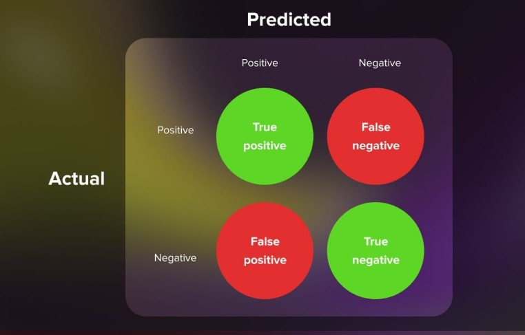

# What is model evaluation?
In machine learning, model evaluation involves analyzing how well a trained model performs when tested on new data. Various evaluation metrics help assess its performance.

These include accuracy, precision, recall, the F1 score, cross-validation and AUC-ROC. Each one gives you a specific view of the model’s strengths and weaknesses in various situations.

Model evaluation also helps you spot overfitting and underfitting. Overfitting occurs when the model does great on the training data but fails to generalize its predictions to new data. On the other hand, underfitting happens when the model is too simple and doesn’t pick up on relevant patterns in the data.

The choice of metrics depends on whether you’re working with unsupervised or supervised learning, and within supervised learning, whether it’s a regression or classification problem. But the basic idea is simple: a model performs well when its predictions closely match the actual outcomes.

## Confusion matrix
A confusion matrix, sometimes called an error matrix, is a simple way to visualize whether all the classes have been covered, and how well a classification algorithm is performing within each of them. It’s essentially a table that shows how many times the actual class labels match up with the predicted ones from the validation dataset. This makes it easy to evaluate the performance of a model and calculate metrics like precision and recall.

This grid is a handy way to visualize how well a model is doing across all classes by displaying the number of correct and incorrect predictions for each class side by side.

For a simple binary classifier, the confusion matrix might look like this:

* The top-left corner shows the true positives (TP), which are the correct predictions for the positive class.
* Just below that, the false positives (FP) show where the model mistakenly predicted something as positive when it wasn’t (also called type I errors).
* The top-right corner displays the false negatives (FN), which are actual positive cases that were wrongly predicted as negative.
* Finally, the bottom-right corner shows the true negatives (TN), where the model correctly predicted the negative class.

If you add up all these values, you get the total number of predictions the model made.

This layout works for binary classification, but it also applies to multiclass problems. Say, you’re building a model to classify different dog breeds.

In a multiclass confusion matrix, the diagonal boxes show correct predictions (true positives) for each class, while the other boxes represent incorrect predictions (false positives, false negatives), depending on which class you’re focusing on.

## How to use the confusion matrix to evaluate a model

### Accuracy
Accuracy measures the percentage of correct predictions. Accuracy is the proportion of all classifications that were correct, whether positive or negative. It is mathematically defined as:

Accuracy = Correct Classifications /Total Classifications.
        = (TP+TN) / (TP+TN+FP+FN)

Let’s say you run a classifier on a dataset with 100 instances, and the confusion matrix shows just one false negative and no false positives. The model has a 99% accuracy, but that doesn’t necessarily mean it’s performing well in every situation. If your model is designed to identify something critical—like contagious diseases—even 1% of misclassified cases could be disastrous. So accuracy alone isn’t always enough, and other metrics are needed to get a more complete picture.

## Precision
Precision tells us how often the model’s positive predictions are actually correct. The positive predictive value (PPV) can be calculated with the following equation.

    Precision = TP / TP + FP

In the spam classification example, precision measures the fraction of emails classified as spam that were actually spam.

A hypothetical perfect model would have zero false positives and therefore a precision of 1.0.

In an imbalanced dataset where the number of actual positives is very, very low, say 1-2 examples in total, precision is less meaningful and less useful as a metric.

Precision improves as false positives decrease, while recall improves when false negatives decrease. But as seen in the previous section, increasing the classification threshold tends to decrease the number of false positives and increase the number of false negatives, while decreasing the threshold has the opposite effects. As a result, precision and recall often show an inverse relationship, where improving one of them worsens the other.

## Recall
Recall, or sensitivity, shows how well the model identifies all the true instances of a class, meaning what percentage of actual positives the model successfully picked up. This is also known as the true positive rate (TPR) and can be calculated with this formula:

    Recall = TP / TP + FN

## F1 score

Precision and recall can sometimes work against each other. When a model boosts recall by correctly identifying more true positives, it often misclassifies more false positives, which lowers precision. The F1 score, or F-measure, combines both metrics into one as a harmonic mean. This allows you to have a better picture of a model’s performance.

You can calculate the F1 score using precision (P) and recall ®, where P stands for precision (positive predictive value) and R is recall (sensitivity).

F1 Score = 2(PR) / P+R

The F1 score works best with imbalanced datasets, where the tradeoff between precision and recall becomes more obvious. Imagine a model that predicts fraudulent transactions. If it predicts no transactions as fraudulent, it may have perfect precision but zero recall, because it misses all the actual fraudulent transactions. Conversely, if the model predicts every transaction as fraudulent, it would have perfect recall but zero precision, as it would be flagging many legitimate transactions as fraudulent. This is a classic case where the F1 score is useful for balancing precision and recall, but in fraud detection, precision might be more critical than recall, depending on the cost of false positives versus false negatives.

As a general guideline, an F1 score of 0.7 or higher is often considered good. But again, you need to consider the specific context. Some applications may necessitate a higher F1 score, especially if both precision and recall are critical.

### Low F1 score
A low F1 score indicates poor overall performance of a binary classification model and can be attributed to various factors, including:

Imbalanced data: In case of an imbalanced dataset, with one class being represented significantly more frequently than the other, the model may struggle to learn to distinguish the minority class, resulting in poor performance and a low score.

Insufficient data: Inadequate dataset size or insufficient representative examples of each class can hinder the model’s ability to learn a robust representation.

Inappropriate model selection: Score might be low if the chosen model is not suitable for the specific task or if it is not properly tuned.

Inadequate features: If the selected features fail to capture the relevant information for the task, the model may struggle to learn meaningful patterns from the data.

### High F1 score
A high F1 score indicates the strong overall performance of a binary classification model. It signifies that the model can effectively identify positive cases while minimizing false positives and false negatives.

You can achieve a high F1 score using the following techniques:

High-quality training data: A high-quality dataset that accurately represents the problem being solved can significantly improve the model’s performance.

Appropriate model selection: Selecting a model architecture well-suited for the specific problem can enhance the model’s ability to learn and identify patterns within the data.

Effective feature engineering: Choosing or creating informative features that capture relevant information from the data can enhance the model’s learning capabilities and generalization.

Hyperparameter tuning: Optimizing the model’s hyperparameters through careful tuning can improve its performance.

## False positive rate
The false positive rate (FPR) is the proportion of all actual negatives that were classified incorrectly as positives, also known as the probability of false alarm. It is mathematically defined as:

FPR = Incorrectly identified actual Negatives / Total all actual negatives  = FP / TN + FP

False positives are actual negatives that were misclassified, which is why they appear in the denominator. In the spam classification example, FPR measures the fraction of legitimate emails that were incorrectly classified as spam, or the model's rate of false alarms.

A perfect model would have zero false positives and therefore a FPR of 0.0, which is to say, a 0% false alarm rate.

In an imbalanced dataset where the number of actual negatives is very, very low, say 1-2 examples in total, FPR is less meaningful and less useful as a metric.

