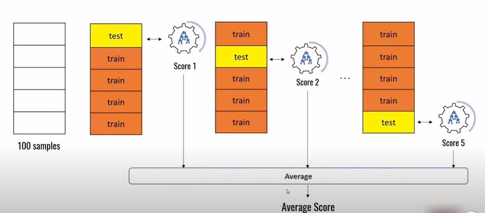

# Cross Validation:

In machine learning, we couldn’t fit the model on the training data and can’t say that the model will work accurately for the real data. For this, we must assure that our model got the correct patterns from the data, and it is not getting up too much noise. For this purpose, we use the cross-validation technique.

## What is Cross-Validation?
Cross validation is a technique used in machine learning to evaluate the performance of a model on unseen data. It involves dividing the available data into multiple folds or subsets, using one of these folds as a validation set, and training the model on the remaining folds. This process is repeated multiple times, each time using a different fold as the validation set. Finally, the results from each validation step are averaged to produce a more robust estimate of the model’s performance.

## K-Fold Cross Validation
In K-Fold Cross Validation, we split the dataset into k number of subsets (known as folds) then we perform training on the all the subsets but leave one(k-1) subset for the testing of the trained model. In this method, we iterate k times with a different subset reserved for testing purpose each time.

## Stratified cross-validation:
Splits the data into K folds while ensuring that each fold contains a representative proportion of each class present in the original dataset.

When your dataset has imbalanced classes, as it helps to prevent the test set from being dominated by the majority class, leading to a more accurate evaluation of your model. 

Imagine a dataset where 90% of data points belong to class A and 10% belong to class B. 
Each fold will always maintain a 90% to 10% ratio of class A to class B, providing a more representative evaluation.

## Advantages and Disadvantages of Cross Validation
### Advantages:
Overcoming Overfitting: Cross validation helps to prevent overfitting by providing a more robust estimate of the model’s performance on unseen data.
Model Selection: Cross validation can be used to compare different models and select the one that performs the best on average.
Hyperparameter tuning: Cross validation can be used to optimize the hyperparameters of a model, such as the regularization parameter, by selecting the values that result in the best performance on the validation set.
Data Efficient: Cross validation allows the use of all the available data for both training and validation, making it a more data-efficient method compared to traditional validation techniques.

### Disadvantages:
Computationally Expensive: Cross validation can be computationally expensive, especially when the number of folds is large or when the model is complex and requires a long time to train.
Time-Consuming: Cross validation can be time-consuming, especially when there are many hyperparameters to tune or when multiple models need to be compared.
Bias-Variance Tradeoff: The choice of the number of folds in cross validation can impact the bias-variance tradeoff, i.e., too few folds may result in high bias, while too many folds may result in high variance.
