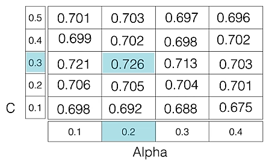

# Hyperparameter
A hyperparameter is a variable that controls how a machine learning model is trained. Hyperparameters are set by data scientists before training, and are different from parameters that are derived during training.

## What do hyperparameters control?
Model architecture: The number of layers and nodes in a neural network, or the number of branches in a decision tree 
Learning rate: How quickly the model learns 
Model complexity: The number of iterations through the training data.

## Why are hyperparameters important? 
The right combination of hyperparameters can significantly improve a model's performance.
Finding the optimal hyperparameters is a crucial step in the machine learning workflow.

## Hyperparameter Tuning
Hyperparameter tuning is the process of selecting the optimal values for a machine learning model’s hyperparameters. 
Hyperparameters are settings that control the learning process of the model, such as the learning rate, the number of neurons in a neural network, or the kernel size in a support vector machine.
The goal of hyperparameter tuning is to find the values that lead to the best performance on a given task.

### Hyperparameters in Support Vector Machine
We take into account some essential hyperparameters for fine-tuning SVMs:

* C: The regularization parameter that controls the trade-off between the margin and the number of training errors. A larger value of C penalizes training errors more heavily, resulting in a smaller margin but potentially better generalization performance. A smaller value of C allows for more training errors but may lead to overfitting.
* Kernel: The kernel function that defines the similarity between data points. Different kernels can capture different relationships between data points, and the choice of kernel can significantly impact the performance of the SVM. Common kernels include linear, polynomial, radial basis function (RBF), and sigmoid.
* Gamma: The parameter that controls the influence of support vectors on the decision boundary. A larger value of gamma indicates that nearby support vectors have a stronger influence, while a smaller value indicates that distant support vectors have a weaker influence. The choice of gamma is particularly important for RBF kernels.

### Hyperparameters in Neural Networks
Neural networks have several essential hyperparameters that need to be adjusted, including:

* Learning rate: This hyperparameter controls the step size taken by the optimizer during each iteration of training. Too small a learning rate can result in slow convergence, while too large a learning rate can lead to instability and divergence.
* Epochs: This hyperparameter represents the number of times the entire training dataset is passed through the model during training. Increasing the number of epochs can improve the model’s performance but may lead to overfitting if not done carefully.
* Number of layers: This hyperparameter determines the depth of the model, which can have a significant impact on its complexity and learning ability.
* Number of nodes per layer: This hyperparameter determines the width of the model, influencing its capacity to represent complex relationships in the data.
* Architecture: This hyperparameter determines the overall structure of the neural network, including the number of layers, the number of neurons per layer, and the connections between layers. The optimal architecture depends on the complexity of the task and the size of the dataset
* Activation function: This hyperparameter introduces non-linearity into the model, allowing it to learn complex decision boundaries. Common activation functions include sigmoid, tanh, and Rectified Linear Unit (ReLU).

### Hyperparameter Tuning techniques
Models can have many hyperparameters and finding the best combination of parameters can be treated as a search problem. The two best strategies for Hyperparameter tuning are:

* GridSearchCV
* RandomizedSearchCV
* Bayesian Optimization

#### GridSearchCV 
Grid search can be considered as a “brute force” approach to hyperparameter optimization. We fit the model using all possible combinations after creating a grid of potential discrete hyperparameter values. We log each set’s model performance and then choose the combination that produces the best results. This approach is called GridSearchCV, because it searches for the best set of hyperparameters from a grid of hyperparameters values. 

An exhaustive approach that can identify the ideal hyperparameter combination is grid search. But the slowness is a disadvantage. It often takes a lot of processing power and time to fit the model with every potential combination, which might not be available.

For example: if we want to set two hyperparameters C and Alpha of the Logistic Regression Classifier model, with different sets of values. The grid search technique will construct many versions of the model with all possible combinations of hyperparameters and will return the best one. 

As in the image, for C = [0.1, 0.2, 0.3, 0.4, 0.5] and Alpha = [0.1, 0.2, 0.3, 0.4]. For a combination of C=0.3 and Alpha=0.2, the performance score comes out to be 0.726(Highest), therefore it is selected. 

The code implementation is given below.

clf = GridSearchCV(svm.SVC(gamma='auto'), {
    'kernel': ['linear', 'rbf'],
    'C' : [10,20]
}, cv = 5, return_train_score= False)

clf.fit(iris.data, iris.target)
print(clf.cv_results_)

Drawback: GridSearchCV will go through all the intermediate combinations of hyperparameters which makes grid search computationally very expensive.   

#### RandomizedSearchCV 
As the name suggests, the random search method selects values at random as opposed to the grid search method’s use of a predetermined set of numbers. Every iteration, random search attempts a different set of hyperparameters and logs the model’s performance. It returns the combination that provided the best outcome after several iterations. This approach reduces unnecessary computation.

RandomizedSearchCV solves the drawbacks of GridSearchCV, as it goes through only a fixed number of hyperparameter settings. It moves within the grid in a random fashion to find the best set of hyperparameters. The advantage is that, in most cases, a random search will produce a comparable result faster than a grid search.

Drawback: It’s possible that the outcome could not be the ideal hyperparameter combination is a disadvantage.

