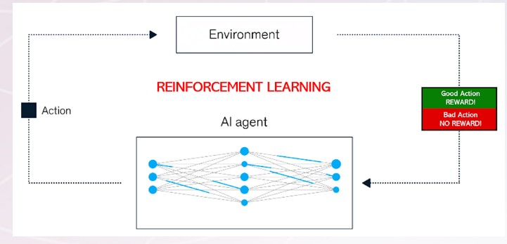
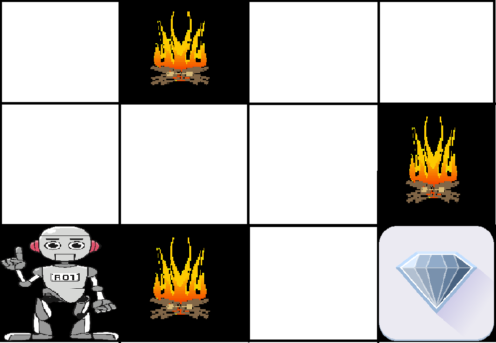

## Artificial Intelligence(AI):

AI is used to build machines that have the ability to mimic human behavior, making decisions equal or surpassing human ability. The ability includes decision making, data analysis, and language translation.

AI is the umbrella term covering variety of subfields like
* Machine Learning
* Natural Language Processing
* Robotics
* Expert Systems and so on.

## Machine Learning:
Machine learning is a subfield of Ai that uses algorithms trained on data to produce models that can perform a variety of complex tasks. ML learns through the data.

#### Example:
Using Machine learning, to detect and prevent fraud and cyber security attacks. 
Troubleshooting a problem online with a chat bot, which directs to appropriate resources, based on user responses.

Three main groups of algorithms in machine learning
* Supervised Learning
* Unsupervised learning
* Reinforcement Learning

### Supervised Learning:
We need to provide label data for the system to learn or train. Once trained, the new images are fed into the system for prediction and determine the accuracy of the model.

Supervised machine learning is a type of machine learning where the model is trained on a labeled dataset (i.e., the target or outcome variable is known). For instance, if data scientists were building a model for tornado forecasting, the input variables might include date, location, temperature, wind flow patterns and more, and the output would be the actual tornado activity recorded for those days.

In supervised learning, the output is known (such as recognizing a picture of an apple) and the model is trained on data of the known output. In simple terms, to train the algorithm to recognize pictures of apples, feed it pictures labeled as apples.

Example: Consider a scenario where you have to build an image classifier to differentiate between cats and dogs. If you feed the datasets of dogs and cats labelled images to the algorithm, the machine will learn to classify between a dog or a cat from these labeled images. When we input new dog or cat images that it has never seen before, it will use the learned algorithms and predict whether it is a dog or a cat. This is how supervised learning works, and this is particularly an image classification.

Supervised learning is commonly used for risk assessment, image recognition, predictive analytics and fraud detection, and comprises several types of algorithms.

Regression algorithms—predict output values by identifying linear relationships between real or continuous values (e.g., temperature, salary). Regression algorithms include linear regression, random forest and gradient boosting, as well as other subtypes.

Classification algorithms—predict categorical output variables (e.g., “junk” or “not junk”) by labeling pieces of input data. Classification algorithms include logistic regression, k-nearest neighbors and support vector machines (SVMs), among others.

#### Advantages of Supervised Machine Learning
* Supervised Learning models can have high accuracy as they are trained on labelled data.
* The process of decision-making in supervised learning models is often interpretable.
* It can often be used in pre-trained models which saves time and resources when developing new models from scratch.

#### Disadvantages of Supervised Machine Learning
* It has limitations in knowing patterns and may struggle with unseen or unexpected patterns that are not present in the training data.
* It can be time-consuming and costly as it relies on labeled data only.
* It may lead to poor generalizations based on new data.

### Unsupervised Learning:
Discovery of new patterns. Clustering of customers into groups based on similarities. The groups did not exist before and were created based on properties.

Unsupervised learning is a type of machine learning technique in which an algorithm discovers patterns and relationships using unlabeled data. Unlike supervised learning, unsupervised learning doesn’t involve providing the algorithm with labeled target outputs. The primary goal of Unsupervised learning is often to discover hidden patterns, similarities, or clusters within the data, which can then be used for various purposes, such as data exploration, visualization, dimensionality reduction, and more.

It draw inferences from unlabeled datasets, facilitating exploratory data analysis and enabling pattern recognition and predictive modeling.

The most common unsupervised learning method is cluster analysis, which uses clustering algorithms to categorize data points according to value similarity (as in customer segmentation or anomaly detection). Association algorithms allow data scientists to identify associations between data objects inside large databases, facilitating data visualization and dimensionality reduction.

There are two main categories of unsupervised learning that are mentioned below:

* Clustering
* Association

#### Clustering
Clustering is the process of grouping data points into clusters based on their similarity. This technique is useful for identifying patterns and relationships in data without the need for labeled examples.

Here are some clustering algorithms:

* K-Means Clustering algorithm
* Principal Component Analysis

K-means clustering—assigns data points into K groups, where the data points closest to a given centroid are clustered under the same category and K represents clusters based on their size and level of granularity. K-means clustering is commonly used for market segmentation, document clustering, image segmentation and image compression.

Principal component analysis, or PCA, is a dimensionality reduction method that is often used to reduce the dimensionality of large data sets, by transforming a large set of variables into a smaller one that still contains most of the information in the large set.

##### Example usage of PCA:
Image Compression:
Reducing the size of images by capturing the essential features in a smaller set of principal components, allowing for efficient storage and transmission.

Noise Reduction:
Removing noise from data by focusing on the principal components with high variance, which represent the underlying signal, while discarding components with low variance that are likely noise,

Anomaly Detection:
Identifying outliers by observing data points that fall far away from the distribution in the principal component space.

#### Association:

A technique that uses algorithms to find patterns in data, such as the probability of items being purchased together. These patterns are called association rules, which are if-then statements that describe how items are related. 

##### How it works
Data analysis: Machine learning models analyze large data sets to find patterns 
Association rules: The algorithm identifies frequent patterns, or association rules, that describe how items are related 
Lift: A value that measures how much more likely one item is to be purchased when another item is purchased 

##### Algorithm:
The most commonly used machine learning algorithm for association rules is the Apriori algorithm. It's an unsupervised learning technique that identifies frequent patterns and relationships between items in a dataset, often used for market basket analysis to discover which items are frequently purchased together

##### Applications
Market basket analysis:
Association rules can be used to analyze shopping data to understand which items are often purchased together 

Customer segmentation:
Association rules can be used to group customers based on their purchasing habits.

Fraud detection:
Association rules can be used to identify unusual patterns in data that may indicate fraudulent activity 

### Reinforcement Learning:
Area of machine learning where the agent learns by trial/error and by awards. Given positive reward for the correct action and negative reward for incorrect actions. Agent is not given instructions on how to perform the task and instead learns by trial and error.

Reinforcement learning (RL) is a machine learning technique that teaches software how to make decisions to achieve the best possible outcome. It's a powerful method for artificial intelligence (AI) systems to learn how to perform tasks in new environments. 

#### How it works
##### Trial and error
RL mimics how humans learn by trial and error. 

##### Reward and punishment
RL uses a reward-and-punishment system to reinforce actions that help achieve a goal and ignore actions that don't. 

#### What it's used for
RL can help AI systems learn how to perform tasks in new environments. 
RL can help robots learn how to navigate and avoid obstacles. 

#### How it's similar to human learning 
RL is similar to how children learn by exploring the world around them and observing the consequences of their actions.

#### Example:
##### Navigating a Maze
The problem is as follows: We have an agent and a reward, with many hurdles in between. The agent is supposed to find the best possible path to reach the reward. The following problem explains the problem more easily.  

The above image shows the robot, diamond, and fire. The goal of the robot is to get the reward that is the diamond and avoid the hurdles that are fired. The robot learns by trying all the possible paths and then choosing the path which gives him the reward with the least hurdles. Each right step will give the robot a reward and each wrong step will subtract the reward of the robot. The total reward will be calculated when it reaches the final reward that is the diamond. 

#### Reinforcement Learning Algorithms
##### Q Learning:
Q-learning is a popular model-free reinforcement learning algorithm used in machine learning and artificial intelligence applications. It falls under the category of temporal difference learning techniques, in which an agent picks up new information by observing results, interacting with the environment, and getting feedback in the form of rewards.

##### How Q Learning works
Q-learning models engage in an iterative process where various components collaborate to train the model. This iterative procedure encompasses the agent exploring the environment and continuously updating the model based on this exploration.

The key components of Q-learning include:

Agents: Entities that operate within an environment, making decisions and taking actions.
States: Variables that identify an agent’s current position in the environment.
Actions: Operations undertaken by the agent in specific states.
Rewards: Positive or negative responses provided to the agent based on its actions.
Episodes: Instances where an agent concludes its actions, marking the end of an episode.
Q-values: Metrics used to evaluate actions at specific states.

#### Q-table
The Q-table is a repository of rewards associated with optimal actions for each state in a given environment. It serves as a guide for the agent, helping it determine which actions are likely to yield the best outcomes. As the agent interacts with the environment, the Q-table is dynamically updated to reflect the agent’s evolving understanding, enabling more informed decision-making.