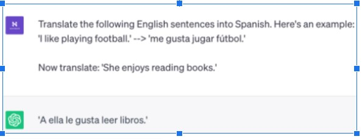
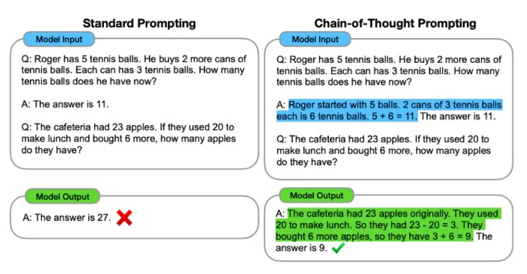

# Prompt Engineering:
## Prompt:

A prompt is a piece of text that is given to the large language model as input and it controls the output in a number of ways.

## Prompt engineering:

Prompt engineering involves crafting precise and context specific instructions or queries, known as prompts, to elicit desired responses from language models.These prompts provide guidance to the model and help to shape its behavior and output.

By leveraging prompt engineering techniques, we can enhance model performance, achieve better control over generated output.

We can use the prompt engineering to improve the safety of LLM and build new capabilities like augmenting LLM with domain knowledge and external tools.

## LLM Settings:
When working with prompts, we interact with LLM through the APi directly. The below parameters are configured to get different results for the prompts.

### Temperature:
Used to control the randomness of the result. Lower the temperature more precise values are returned, if higher, the results will be more creative and random. In terms of application, we can use the lower temperature for fact based QA and higher values, for applications like creating poems etc.,

### Top p:

Helps in controlling the predictability of the result and determining how long the result should be. Also known as nucleus sampling. It sets the threshold probability and selects the top tokens whose cumulative probability exceeds the threshold.

The model then randomly samples from these sets of tokens to generate the output. This method can provide more diverse and interesting output than traditional methods that randomly sample the entire vocabulary.

Eg. If we set the top p to .9, then it will consider the words that have 90% probability of occurring.

### Token length:
This is the number of words or text that can be fed into the LLM as the input. The length of the input may affect the result the LLM produces. The shorter input may not give context to the LLM to produce the desired result.
Also, a very long input may make the model inefficiently process and produce irrelevant results. Hence optimal input is needed to provide sufficient context and produce desired results.

### Max Tokens:
This is the maximum number of tokens the LLM can generate.  

The computational cost and memory requirements are directly proportional to the max tokens. Set a longer max tokens, there will be greater context and coherent output text. Setting a shorter output token, we will use less memory and have a faster response and could be prone to errors and inconsistencies.

During the training and fine tuning of LLM, the max tokens are set.

### Frequency penalty:
Frequency penalty helps in avoiding repeating the same words again. Hence, the frequency penalty stops the repetition. Consider, the model is generating text and it is repeating the same words again and hence in this case this frequency penalty is used.

Imagine you’re using a language model to generate text, and you’ve set a Frequency_penalty value of 0.2. Here’s how it works with a sample word, let’s say “apple.”
* The model generates the word “apple” for the first time. Its log-probability is, let’s say, -1.0.
* Now, if the model generates “apple” again in the text, the Frequency_penalty of 0.2 is added to its log-probability.
* So, for the second occurrence of “apple,” the log-probability becomes -1.0 + 0.2 = -0.8.
This increase in log-probability encourages the model to avoid repeating the same word too frequently within the text.

### Presence penalty:
Presence penalty encourages using a variety of words in the paragraph. Hence, it encourages variety.

Let’s assume you’ve set a Presence_penalty of 0.3. Again, we’ll use the example of the word “apple.”
The model generates the word “apple” for the first time with a log-probability of -1.0.
Now, if the model generates “apple” again in the text, the Presence_penalty of 0.3 is subtracted from its log-probability.
So, for the second occurrence of “apple,” the log-probability becomes -1.0–0.3 = -1.3.
This decrease in log-probability encourages the model to favour tokens that haven’t been used frequently in the generated text, promoting diversity.

## Elements of a Prompt

A prompt contains any of the following elements:

* Instruction - a specific task or instruction you want the model to perform
* Context -  external information or additional context that can steer the model to better responses
* Input Data - the input or question that we are interested to find a response for
* Output Indicator - the type or format of the output.

We do not need all the four elements for a prompt and the format depends on the task at hand. We will touch on more concrete examples in upcoming guides.

## General Tips for Designing Prompts
### Start Simple ###

Designing prompts, we should keep in mind that it is really an iterative process that requires a lot of experimentation to get optimal results.  When you have a big task that involves many different subtasks, you can try to break down the task into simpler subtasks and keep building up as you get better results. This avoids adding too much complexity to the prompt design process at the beginning.

### The Instruction ###
You can design effective prompts for various simple tasks by using commands to instruct the model what you want to achieve, such as "Write", "Classify", "Summarize", "Translate", "Order", etc. Example:

#### Prompt ####

Instruction: 
Translate the text below to Spanish:Text: "hello!"

#### Output ####
¡Hola!

### Specificity ###

Be very specific about the instruction and task you want the model to perform. The more descriptive and detailed the prompt is, the better the results. This is particularly important when you have a desired outcome or style of generation you are seeking.

#### Prompt: ####
Extract the name of places in the following text.

Desired format:Place: <comma_separated_list_of_company_names>Input: "Although these developments are encouraging to researchers, much is still a mystery. “We often have a black box between the brain and the effect we see in the periphery,” says Henrique Veiga-Fernandes, a neuroimmunologist at the Champalimaud Centre for the Unknown in Lisbon. “If we want to use it in the therapeutic context, we actually need to understand the mechanism.""

#### Output: ####
Place: Champalimaud Centre for the Unknown, Lisbon

### Avoid Impreciseness
Given the tips above about being detailed and improving format, it's easy to fall into the trap of wanting to be too clever about prompts and potentially creating imprecise descriptions. It's often better to be specific and direct. The analogy here is very similar to effective communication -- the more direct, the more effective the message gets across.
For example, you might be interested in learning the concept of prompt engineering. You might try something like:

* Explain the concept prompt engineering. Keep the explanation short, only a few sentences, and don't be too descriptive. *
It's not clear from the prompt above how many sentences to use and what style. You might still somewhat get good responses with the above prompts but the better prompt would be one that is very specific, concise, and to the point. Something like:

* Use 2-3 sentences to explain the concept of prompt engineering to a high school student. *
  
## Types of Prompts

### Text Summarization:
One of the standard tasks in natural language generation is text summarization. Text summarization can include many different flavors and domains. In fact, one of the most promising applications of language models is the ability to summarize articles and concepts into quick and easy-to-read summaries. Let's try a basic summarization task using prompts.
Let's say you are interested to learn about antibiotics, you could try a prompt like this:

#### Prompt: ####
Explain antibiotics:

#### Output: ####
Antibiotics are a type of medication used to treat bacterial infections. They work by either killing the bacteria or preventing them from reproducing, allowing the body’s immune system to fight off the infection. Antibiotics are usually taken orally in the form of pills, capsules, or liquid solutions, or sometimes administered intravenously. They are not effective against viral infections, and using them inappropriately can lead to antibiotic resistance.

Let's just assume that this is too much information and you want to summarize it further. In fact, you can instruct the model to summarize into one sentence like so:

#### Prompt: ####
Antibiotics are a type of medication used to treat bacterial infections. They work by either killing the bacteria or preventing them from reproducing, allowing the body’s immune system to fight off the infection. Antibiotics are usually taken orally in the form of pills, capsules, or liquid solutions, or sometimes administered intravenously. They are not effective against viral infections, and using them inappropriately can lead to antibiotic resistance.Explain the above in one sentence:

#### Output:#### 
Antibiotics are medications used to treat bacterial infections by either killing the bacteria or stopping them from reproducing, but they are not effective against viruses and overuse can lead to antibiotic resistance.

### Information Extraction
While language models are trained to perform natural language generation and related tasks, it's also very capable of performing classification and a range of other natural language processing (NLP) tasks.
Here is an example of a prompt that extracts information from a given paragraph.

#### Prompt: ####
Author-contribution statements and acknowledgements in research papers should state clearly and specifically whether, and to what extent, the authors used AI technologies such as ChatGPT in the preparation of their manuscript and analysis. They should also indicate which LLMs were used. This will alert editors and reviewers to scrutinize manuscripts more carefully for potential biases, inaccuracies and improper source crediting. Likewise, scientific journals should be transparent about their use of LLMs, for example when selecting submitted manuscripts.Mention the large language model based product mentioned in the paragraph above:

#### Output: ####
The large language model based product mentioned in the paragraph above is ChatGPT.

There are many ways you can improve the results above, but this is already very useful.

### Question Answering

One of the best ways to get the model to respond to specific answers is to improve the format of the prompt. As covered before, a prompt could combine instructions, context, input, and output indicators to get improved results. While these components are not required, it becomes a good practice as the more specific you are with instruction, the better results you will get. Below is an example of how this would look following a more structured prompt.

#### Prompt: ####
Answer the question based on the context below. Keep the answer short and concise. Respond "Unsure about answer" if not sure about the answer.
Context: Teplizumab traces its roots to a New Jersey drug company called Ortho Pharmaceutical. There, scientists generated an early version of the antibody, dubbed OKT3. Originally sourced from mice, the molecule was able to bind to the surface of T cells and limit their cell-killing potential. In 1986, it was approved to help prevent organ rejection after kidney transplants, making it the first therapeutic antibody allowed for human use.
Question: What was OKT3 originally sourced from?Answer:

#### Output: ####
Mice.   

### Text Classification

We need to think more about the context and the different elements you can use in a prompt. Other elements you can provide are input data or examples. Let's try to demonstrate this by providing an example of text classification.

#### Prompt: ####
Classify the text into neutral, negative or positive. Text: I think the food was okay.
 Sentiment:

#### Output: ####   
Neutral

We care about specificity here, so the more information you can provide the prompt, the better results. You can try providing examples to specify the correct behavior. Let's try again:

#### Prompt: ####
Classify the text into neutral, negative or positive. 

Text: I think the vacation is okay.
Sentiment: neutral
 Text: I think the food was okay.
 Sentiment:

#### Output: ####   
neutral

Perfect! This time the model returned neutral which is the specific label you were looking for. It seems that the example provided in the prompt helped the model to be specific in its output.

## Conversation

We can create a conversational system that's able to generate more technical and scientific responses to questions. Note how you are explicitly telling it how to behave through the instruction. This is sometimes referred to as role prompting.

### Prompt: ###
The following is a conversation with an AI research assistant. 
The assistant tone is technical and scientific.
Human: Hello, who are you?
AI: Greeting! I am an AI research assistant. How can I help you today?
Human: Can you tell me about the creation of blackholes?
AI:

### Output: ###
Sure! Black holes are regions of spacetime where the gravitational force is so strong that nothing, not even light, can escape from it. They are created when a very massive star dies and its core collapses in on itself, forming a singularity of infinite density. The intense gravity of the singularity pulls in all the matter and radiation around it, creating the black hole.
Our AI research assistant sounds a bit too technical, right? Okay, let's change this behavior and instruct the system to give more accessible answers.

### Prompt: ###
The following is a conversation with an AI research assistant. The assistant answers should be easy to understand even by primary school students.
Human: Hello, who are you?
AI: Greeting! I am an AI research assistant. How can I help you today?
Human: Can you tell me about the creation of black holes?
AI:

### Output: ###
Sure! Black holes are created when a very massive star runs out of fuel and collapses in on itself. The gravity of the star is so strong that nothing, not even light, can escape its pull. This creates a point in space-time with an intense gravitational force called a black hole.

## Code Generation
One application where LLMs are quite effective is code generation. Copilot is a great example of this. There are a vast number of code-generation tasks you can perform with clever prompts. Let's look at a few examples below.

First, let's try a simple program that greets the user.
### Prompt: ###
/*Ask the user for their name and say "Hello"*/

### Output: ###
let name = prompt("What is your name?");
console.log(`Hello, ${name}!`);
Notice that you didn't even need to specify the language to use. Let's switch levels a bit. The example below shows how powerful LLMs can be with a little more effort in designing the prompts.

### Prompt: ###
"""Table departments, columns = [DepartmentId, DepartmentName]Table students, columns = [DepartmentId, StudentId, StudentName]Create a MySQL query for all students in the Computer Science Department"""

### Output: ###
SELECT StudentId, StudentName FROM students WHERE DepartmentId IN (SELECT DepartmentId FROM departments WHERE DepartmentName = 'Computer Science');

This is very impressive. In this case, you provided data about the database schema and asked it to generate a valid MySQL query.

## Reasoning
Perhaps one of the most difficult tasks for an LLM today is one that requires some form of reasoning. Reasoning is one of most interesting areas due to the types of complex applications that can emerge from LLMs.
There have been some improvements in tasks involving mathematical capabilities. That said, it's important to note that current LLMs struggle to perform reasoning tasks so this requires even more advanced prompt engineering techniques. We will cover these advanced techniques in the next guide. For now, we will cover a few basic examples to show arithmetic capabilities.

### Prompt: ###
What is 9,000 * 9,000?

### Output: ###
81,000,000
Let's try something more difficult.

### Prompt: ###
The odd numbers in this group add up to an even number: 15, 32, 5, 13, 82, 7, 1. A:

### Output ###
No, the odd numbers in this group add up to an odd number: 119.
That's incorrect! Let's try to improve this by improving the prompt.

### Prompt: ###
The odd numbers in this group add up to an even number: 15, 32, 5, 13, 82, 7, 1. 
Solve by breaking the problem into steps.
First, identify the odd numbers, add them, and indicate whether the result is odd or even.

### Output: ###           
Odd numbers: 15, 5, 13, 7, 1
Sum: 41 
41 is an odd number.

## Prompt Techniques:
### Zero-Shot Prompting
In natural language processing models, zero-shot prompting means providing a prompt that is not part of the training data to the model, but the model can generate a result that you desire. This promising technique makes large language models useful for many tasks.
While zero-shot prompting enables quick and efficient responses without specific training, few-shot prompting fine-tunes the model with minimal examples for enhanced accuracy. Zero-shot prompting allows models to generalize without labeled data, while few-shot leverages several examples to adapt quickly.

Zero-shot prompting involves generating a response without feeding the large language models any examples or prior context. This technique is ideal when you need quick answers to basic questions or general topics.

### Examples: ###
* Can you describe Random Access Memory?
* Classify the text into positive, neutral or negative:
  Text: That shot selection was awesome.
  Classification

### One-Shot or Few shot Prompting:
One-shot prompting is about extracting a response based on example or piece of context provided by the user.

### Chain-of-Thought (CoT) Prompting
chain-of-thought (CoT) prompting enables complex reasoning capabilities through intermediate reasoning steps. You can combine it with few-shot prompting to get better results on more complex tasks that require reasoning before responding.

### Example 1: ###

### Example 2: ###
#### Prompt: ####
The odd numbers in this group add up to an even number: 4, 8, 9, 15, 12, 2, 1.A: Adding all the odd numbers (9, 15, 1) gives 25. The answer is False.The odd numbers in this group add up to an even number: 17,  10, 19, 4, 8, 12, 24.A: Adding all the odd numbers (17, 19) gives 36. The answer is True.The odd numbers in this group add up to an even number: 16,  11, 14, 4, 8, 13, 24.A: Adding all the odd numbers (11, 13) gives 24. The answer is True.The odd numbers in this group add up to an even number: 17,  9, 10, 12, 13, 4, 2.A: Adding all the odd numbers (17, 9, 13) gives 39. The answer is False.The odd numbers in this group add up to an even number: 15, 32, 5, 13, 82, 7, 1. A:

#### Output: ####
Adding all the odd numbers (15, 5, 13, 7, 1) gives 41. The answer is False.