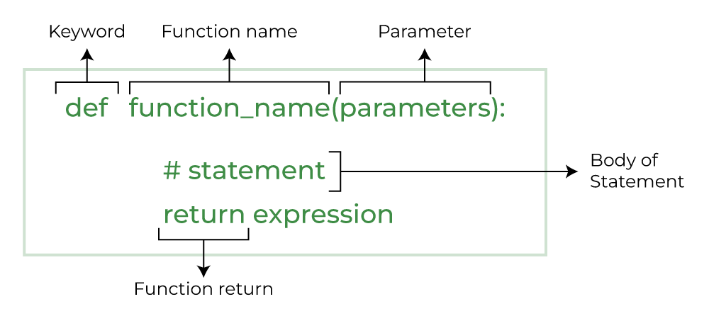

# Python Functions:
## Introduction:
Python Functions is a block of statements that return the specific task. The idea is to put some commonly or repeatedly done tasks together and make a function so that instead of writing the same code again and again for different inputs, we can do the function calls to reuse code contained in it over and over again.

Some Benefits of Using Functions

Increase Code Readability 
Increase Code Reusability

## Python Function Declaration
The syntax to declare a function is:

 

## Types of Functions in Python
`Built-in library function`: These are Standard functions in Python that are available to use.
`User-defined function`: We can create our own functions based on our requirements.

## Creating a Function in Python
We can define a function in Python, using the def keyword. We can add any type of functionalities and properties to it as we require.

```
# A simple Python function 

def fun():
print("Welcome to GFG")
```

## Calling a  Python Function
After creating a function in Python we can call it by using the name of the function followed by parenthesis containing parameters of that particular function.

```
# A simple Python function
def fun():
	print("Welcome to GFG")


# Driver code to call a function
fun()
# Output:
Welcome to GFG

```

## Python Function Arguments
Arguments are the values passed inside the parenthesis of the function. A function can have any number of arguments separated by a comma.

In this example, we will create a simple function in Python to check whether the number passed as an argument to the function is even or odd.

```
# A simple Python function to check
# whether x is even or odd
def evenOdd(x):
	if (x % 2 == 0):
		print("even")
	else:
		print("odd")


# Driver code to call the function
evenOdd(2)
evenOdd(3)

# Output:

even
odd
```
## Types of Python Function Arguments
Python supports various types of arguments that can be passed at the time of the function call. In Python, we have the following 4 types of function arguments.

* Default argument
* Keyword arguments (named arguments)
* Positional arguments
* Arbitrary arguments (variable-length arguments *args and **kwargs)
Let’s discuss each type in detail. 

### Default Arguments
A default argument is a parameter that assumes a default value if a value is not provided in the function call for that argument. The following example illustrates Default arguments. 

```
# Python program to demonstrate
# default arguments
def myFun(x, y=50):
    print("x: ", x)
    print("y: ", y)
 
 
# Driver code (We call myFun() with only
# argument)
myFun(10)

# Output:

x:  10
y:  50

```

## Keyword Arguments
The idea is to allow the caller to specify the argument name with values so that the caller does not need to remember the order of parameters.

```
# Python program to demonstrate Keyword Arguments
def student(firstname, lastname):
	print(firstname, lastname)


# Keyword arguments
student(firstname='Geeks', lastname='Practice')
student(lastname='Practice', firstname='Geeks')

# Output:

Geeks Practice
Geeks Practice
```

## Positional Arguments
We used the Position argument during the function call so that the first argument (or value) is assigned to name and the second argument (or value) is assigned to age. By changing the position, or if you forget the order of the positions, the values can be used in the wrong places, as shown in the Case-2 example below, where 27 is assigned to the name and Suraj is assigned to the age.

```
def nameAge(name, age):
    print("Hi, I am", name)
    print("My age is ", age)
 
 
# You will get correct output because 
# argument is given in order
print("Case-1:")
nameAge("Suraj", 27)
# You will get incorrect output because
# argument is not in order
print("\nCase-2:")
nameAge(27, "Suraj")

# Output:

Case-1:
Hi, I am Suraj
My age is  27
Case-2:
Hi, I am 27
My age is  Suraj
```

### Arbitrary Keyword  Arguments
In Python Arbitrary Keyword Arguments, *args, and **kwargs can pass a variable number of arguments to a function using special symbols. There are two special symbols:

*args in Python (Non-Keyword Arguments)
**kwargs in Python (Keyword Arguments)
Example 1: Variable length non-keywords argument

```
# Python program to illustrate
# *args for variable number of arguments
def myFun(*argv):
	for arg in argv:
		print(arg)


myFun('Hello', 'Welcome', 'to', 'GeeksforGeeks')
# Output:

Hello
Welcome
to
GeeksforGeeks

```
### Example 2: Variable length keyword arguments

```   
# Python program to illustrate
# *kwargs for variable number of keyword arguments
 
 
def myFun(**kwargs):
    for key, value in kwargs.items():
        print("%s == %s" % (key, value))
 
 
# Driver code
myFun(first='Geeks', mid='for', last='Geeks')
Output:

first == Geeks
mid == for
last == Geeks

# Output:

first == Geeks
mid == for
last == Geeks

```

### Docstring
The first string after the function is called the Document string or Docstring in short. This is used to describe the functionality of the function. The use of docstring in functions is optional but it is considered a good practice.

The below syntax can be used to print out the docstring of a function:

`Syntax: print(function_name.__doc__)`
Example: Adding Docstring to the function

```
# A simple Python function to check
# whether x is even or odd


def evenOdd(x):
	"""Function to check if the number is even or odd"""
	
	if (x % 2 == 0):
		print("even")
	else:
		print("odd")


# Driver code to call the function
print(evenOdd.__doc__)
#Output:

Function to check if the number is even or odd

```
## Python Function within Functions
A function that is defined inside another function is known as the inner function or nested function. Nested functions can access variables of the enclosing scope. Inner functions are used so that they can be protected from everything happening outside the function.

```
# Python program to
# demonstrate accessing of
# variables of nested functions

def f1():
	s = 'I love GeeksforGeeks'
	
	def f2():
		print(s)
		
	f2()

# Driver's code
f1()

# Output:

I love GeeksforGeeks

```
## Anonymous Functions in Python
In Python, an anonymous function means that a function is without a name. As we already know the def keyword is used to define the normal functions and the lambda keyword is used to create anonymous functions.

```   
# Python code to illustrate the cube of a number
# using lambda function
def cube(x): return x*x*x
 
cube_v2 = lambda x : x*x*x
 
print(cube(7))
print(cube_v2(7))
#Output:

343
343

```

## Return Statement in Python Function
The function return statement is used to exit from a function and go back to the function caller and return the specified value or data item to the caller. The syntax for the return statement is:

return [expression_list]
The return statement can consist of a variable, an expression, or a constant which is returned at the end of the function execution. If none of the above is present with the return statement a None object is returned.

Example: Python Function Return Statement

```   
def square_value(num):
    """This function returns the square
    value of the entered number"""
    return num**2
 
 
print(square_value(2))
print(square_value(-4))

Output:

4
16
```

## Pass by Reference and Pass by Value
One important thing to note is, in Python every variable name is a reference. When we pass a variable to a function, a new reference to the object is created. Parameter passing in Python is the same as reference passing in Java.

```

# Here x is a new reference to same list lst
def myFun(x):
    x[0] = 20
 
 
# Driver Code (Note that lst is modified
# after function call.
lst = [10, 11, 12, 13, 14, 15]
myFun(lst)
print(lst)

# Output:

[20, 11, 12, 13, 14, 15]

```
When we pass a reference and change the received reference to something else, the connection between the passed and received parameters is broken. For example, consider the below program as follows:

```
def myFun(x):

	# After below line link of x with previous
	# object gets broken. A new object is assigned
	# to x.
	x = [20, 30, 40]


# Driver Code (Note that lst is not modified
# after function call.
lst = [10, 11, 12, 13, 14, 15]
myFun(lst)
print(lst)
# Output:

[10, 11, 12, 13, 14, 15]

```