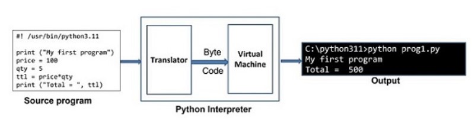

# Python Interpreter:
##  Python Interpreter Command Prompt Mode

It is very easy to display the Hello World message using the Python interpreter. Launch the Python interpreter from a command terminal of your Windows Operating System and issue the print statement from the Python prompt as follows

``` PS  C:\> python
Python 3.11.2 (tags/v3.11.2:878ead1, Feb 7 2023, 16:38:35) [MSC v.1934 64 bit (AMD64)] on win32
Type "help", "copyright", "credits" or "license" for more information.

>>> print ("Hello World")
Hello World 
```

## Using Python Interpreter Script Mode

Python interpreter also works in scripted mode. Open any text editor, enter the following text and save as Hello.py

```
print ("Hello World")
For Windows OS, open the command prompt terminal (CMD) and run the program as shown below −

C:\>python hello.py
```
This will display the following output

``` Hello World ```

To run the program from Linux terminal

``` $ python3 hello.py ```

This will display the following output

```Hello World ```


## Python Interpreter
Python is an interpreter-based language. In a Linux system, Python's executable is installed in /usr/bin/ directory. For Windows, the executable (python.exe) is found in the installation folder (for example C:\python311).

 Python code is executed by one statement at a time method. Python interpreter has two components. The translator checks the statement for syntax. If found correct, it generates an intermediate byte code. There is a Python virtual machine which then converts the byte code in native binary and executes it. The following diagram illustrates the mechanism:

 

Python interpreter has an interactive mode and a scripted mode.

### Python Interpreter - Interactive Mode

When launched from a command line terminal without any additional options, a Python prompt >>> appears and the Python interpreter works on the principle of `REPL (Read, Evaluate, Print, Loop)`. Each command entered in front of the Python prompt is read, translated and executed. A typical interactive session is as follows.

```
>>> price = 100
>>> qty = 5
>>> total = price*qty
>>> total
500
>>> print ("Total = ", total)
Total = 500
```

To close the interactive session, enter the end-of-line character (ctrl+D for Linux and ctrl+Z for Windows). We may also type quit() in front of the Python prompt and press Enter to return to the OS prompt.

` >>> quit() `

The interactive shell available with standard Python distribution is not equipped with features like line editing, history search, auto-completion etc. We can use other advanced interactive interpreter software such as IPython and bpython to have additional functionalities.

### Python Interpreter - Scripting Mode

Instead of entering and obtaining the result of one instruction at a time as in the interactive environment, it is possible to save a set of instructions in a text file, make sure that it has .py extension, and use the name as the command line parameter for Python command.

Save the following lines as prog.py, with the use of any text editor such as vim on Linux or Notepad on Windows.

```
print ("My first program")
price = 100
qty = 5
total = price*qty
print ("Total = ", total)
```

When we execute above program on a Windows machine, it will produce following result:

```
C:\Users\Win>python prog.py
My first program
Total = 500
```

Note that even though Python executes the entire script in one go, but internally it is still executed in line by line fashion.

In case of any compiler-based language such as Java, the source code is not converted in byte code unless the entire code is error-free. In Python, on the other hand, statements are executed until first occurrence of error is encountered.

Let us introduce an error purposefully in the above code.

```
print ("My first program")
price = 100
qty = 5
total = prive*qty #Error in this statement
print ("Total = ", total)
```

Note the misspelt variable prive instead of price. Try to execute the script again as before −
```
C:\Users\Acer>python prog.py
My first program
Traceback (most recent call last):
  File "C:\Python311\prog.py", line 4, in <module>
   total = prive*qty
   ^^^^^
NameError: name 'prive' is not defined. Did you mean: 'price'?

```

Note that the statements before the erroneous statement are executed and then the error message appears. Thus it is now clear that Python script is executed in interpreted manner.

