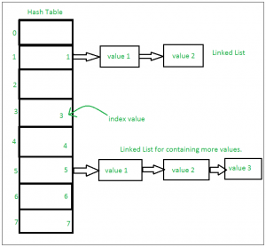

# Sets in Python:

A Set in Python programming is an unordered collection data type that is iterable, mutable and has no duplicate elements. 

Set are represented by { } (values enclosed in curly braces)

The major advantage of using a set, as opposed to a list, is that it has a highly optimized method for checking whether a specific element is contained in the set. This is based on a data structure known as a hash table. Since sets are unordered, we cannot access items using indexes as we do in lists.

```
var = {"Geeks", "for", "Geeks"}
type(var)
#Output:
set
```

## Type Casting with Python Set method
The Python set() method is used for type casting.

```
   
# typecasting list to set
myset = set(["a", "b", "c"])
print(myset)
 
# Adding element to the set
myset.add("d")
print(myset)
```
Python set is an unordered datatype, which means we cannot know in which order the elements of the set are stored.

{'c', 'b', 'a'}
{'d', 'c', 'b', 'a'}

## Check unique and  Immutable with Python Set
Python sets cannot have a duplicate value and once it is created we cannot change its value.

   
```
# Python program to demonstrate that
# a set cannot have duplicate values 
# and we cannot change its items

# a set cannot have duplicate values
myset = {"Geeks", "for", "Geeks"}
print(myset)

# values of a set cannot be changed
myset[1] = "Hello"
print(myset)

```

Output:

The first code explains that the set cannot have a duplicate value. Every item in it is a unique value. 

The second code generates an error because we cannot assign or change a value once the set is created. We can only add or delete items in the set.

{'Geeks', 'for'}
TypeError: 'set' object does not support item assignment

## Heterogeneous Element with Python Set
Python sets can store heterogeneous elements in it, i.e., a set can store a mixture of string, integer, boolean, etc datatypes.

```
   
# Python example demonstrate that a set
# can store heterogeneous elements
myset = {"Geeks", "for", 10, 52.7, True}
print(myset)
# Output:

{True, 10, 'Geeks', 52.7, 'for'}
```

## Python Frozen Sets
Frozen sets in Python are immutable objects that only support methods and operators that produce a result without affecting the frozen set or sets to which they are applied. It can be done with frozenset() method in Python.

While elements of a set can be modified at any time, elements of the frozen set remain the same after creation. 

If no parameters are passed, it returns an empty frozenset.

```
  
# Python program to demonstrate differences
# between normal and frozen set
 
# Same as {"a", "b","c"}
normal_set = set(["a", "b","c"])
 
print("Normal Set")
print(normal_set)
 
# A frozen set
frozen_set = frozenset(["e", "f", "g"])
 
print("\nFrozen Set")
print(frozen_set)
 
# Uncommenting below line would cause error as
# we are trying to add element to a frozen set
# frozen_set.add("h")

#Output:

Normal Set
{'a', 'c', 'b'}

Frozen Set
{'e', 'g', 'f'}

```

## Internal working of Set
This is based on a data structure known as a hash table.  If Multiple values are present at the same index position, then the value is appended to that index position, to form a Linked List.

In, Python Sets are implemented using a dictionary with dummy variables, where key beings the members set with greater optimizations to the time complexity.

Set Implementation:

 

Sets with Numerous operations on a single HashTable:


 

## Methods for Sets
### Adding elements to Python Sets
Insertion in the set is done through the set.add() function, where an appropriate record value is created to store in the hash table. Same as checking for an item, i.e., O(1) on average. However, in worst case it can become O(n).

```
# A Python program to
# demonstrate adding elements
# in a set

# Creating a Set
people = {"Jay", "Idrish", "Archi"}

print("People:", end = " ")
print(people)

# This will add Daxit
# in the set
people.add("Daxit")

# Adding elements to the
# set using iterator
for i in range(1, 6):
	people.add(i)

print("\nSet after adding element:", end = " ")
print(people)

#Output:

People: {'Idrish', 'Archi', 'Jay'}

Set after adding element: {1, 2, 3, 4, 5, 'Idrish', 'Archi', 'Jay', 'Daxit'}
```

### Union operation on Python Sets
Two sets can be merged using union() function or | operator. Both Hash Table values are accessed and traversed with merge operation perform on them to combine the elements, at the same time duplicates are removed. The Time Complexity of this is O(len(s1) + len(s2)) where s1 and s2 are two sets whose union needs to be done.


```
# Python Program to
# demonstrate union of
# two sets

people = {"Jay", "Idrish", "Archil"}
vampires = {"Karan", "Arjun"}
dracula = {"Deepanshu", "Raju"}

# Union using union()
# function
population = people.union(vampires)

print("Union using union() function")
print(population)

# Union using "|"
# operator
population = people|dracula

print("\nUnion using '|' operator")
print(population)

# Output:

Union using union() function
{'Karan', 'Idrish', 'Jay', 'Arjun', 'Archil'}

Union using '|' operator
{'Deepanshu', 'Idrish', 'Jay', 'Raju', 'Archil'}
```

## Intersection operation on Python Sets
This can be done through intersection() or & operator. Common Elements are selected. They are similar to iteration over the Hash lists and combining the same values on both the Table. Time Complexity of this is O(min(len(s1), len(s2)) where s1 and s2 are two sets whose union needs to be done.

```
# Python program to
# demonstrate intersection
# of two sets

set1 = set()
set2 = set()

for i in range(5):
	set1.add(i)

for i in range(3,9):
	set2.add(i)

# Intersection using
# intersection() function
set3 = set1.intersection(set2)

print("Intersection using intersection() function")
print(set3)

# Intersection using
# "&" operator
set3 = set1 & set2

print("\nIntersection using '&' operator")
print(set3)

#Output:

Intersection using intersection() function
{3, 4}

Intersection using '&' operator
{3, 4}

```
## Finding Differences of Sets in Python
To find differences between sets. Similar to finding differences in the linked list. This is done through difference() or – operator. Time complexity of finding difference s1 – s2 is O(len(s1))

```
# Python program to
# demonstrate difference
# of two sets

set1 = set()
set2 = set()

for i in range(5):
	set1.add(i)

for i in range(3,9):
	set2.add(i)

# Difference of two sets
# using difference() function
set3 = set1.difference(set2)

print(" Difference of two sets using difference() function")
print(set3)

# Difference of two sets
# using '-' operator
set3 = set1 - set2

print("\nDifference of two sets using '-' operator")
print(set3)

#Output:

Difference of two sets using difference() function
{0, 1, 2}

Difference of two sets using '-' operator
{0, 1, 2}


``` 

##  Clearing Python Sets
Set Clear() method empties the whole set inplace.

``` 
# Python program to
# demonstrate clearing
# of set
 
set1 = {1,2,3,4,5,6}
 
print("Initial set")
print(set1)
 
# This method will remove
# all the elements of the set
set1.clear()
 
print("\nSet after using clear() function")
print(set1)

# Output:

Initial set
{1, 2, 3, 4, 5, 6}

Set after using clear() function
set()
```

# Operators for Sets
Sets and frozen sets support the following operators:

Operators	Notes
key in s	containment check
key not in s	non-containment check
s1 == s2	s1 is equivalent to s2
s1 != s2	s1 is not equivalent to s2
s1 <= s2	s1 is subset of s2
s1 < s2	s1 is proper subset of s2
s1 >= s2	s1 is superset of s2
s1 > s2	s1 is proper superset of s2
s1 | s2	the union of s1 and s2
s1 & s2	the intersection of s1 and s2
s1 – s2	the set of elements in s1 but not s2
s1 ˆ s2	the set of elements in precisely one of s1 or s2

[Back](./README.md)