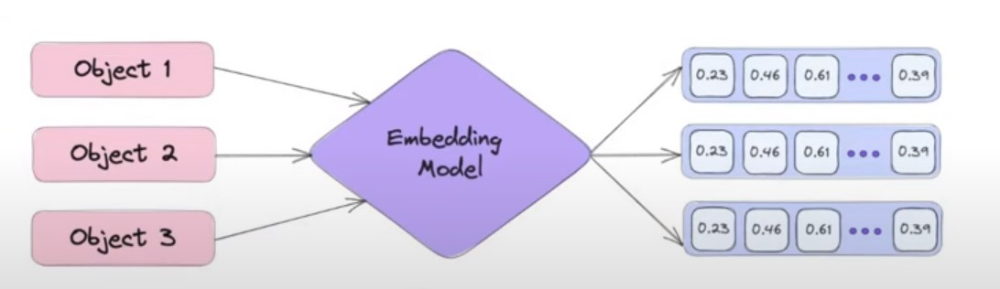
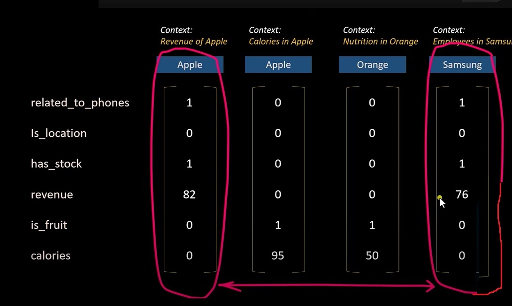
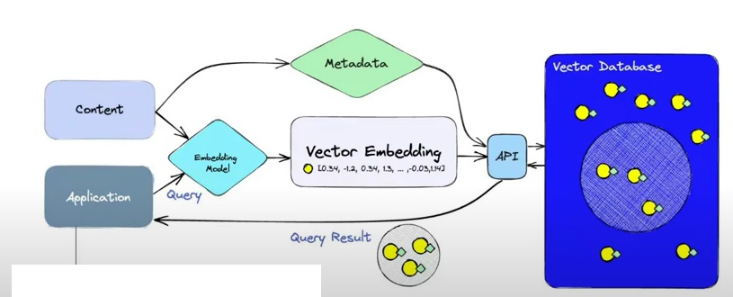
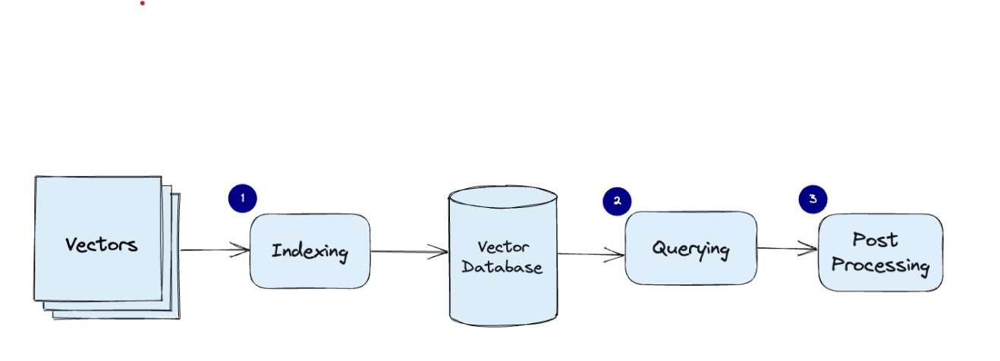
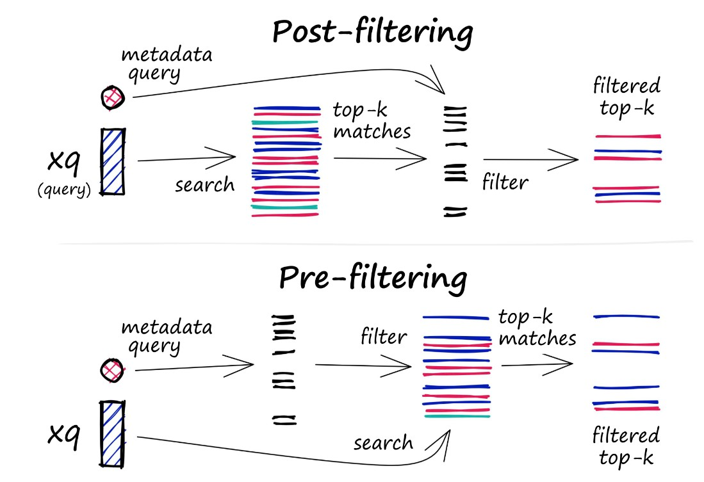

# Vector Database

## What is a Vector Database?

A vector database is a type of database that indexes and stores vector embeddings for fast retrieval and similarity search, which capabilities like CRUD operations, metadata filtering and horizontal scaling.

All the new applications rely on vector embeddings, a type of vector data representation that carries within it semantic information that is critical for the AI to gain understanding and maintain a long term memory they can draw upon when executing complex tasks.

Embeddings have many attributes or features which represent different dimensions of data that are essential for understanding patterns, relationship, and underlying structures.

Hence, a vector database allows us to manage vectors at scale. It allows us to quickly insert, update and delete them as necessary.

It allows us to efficiently find similar vectors given a query vector based on similarity metric.

A vector database allows us to associate metadata with each one of our vectors.

## What is Embeddings?

AI mimics the human brain using neural networks. Neural networks consists of many interconnected 'neurons' in layers. These networks learn from huge amounts of data, adjusting the connections between neurons. 

Once trained, the AI model extracts high level features from the data which it uses  to make the predictions or decisions.

These features are represented as vectors in high dimensional space which is known as embeddings.

Hence, embeddings are numerical representations that capture the essential features and relationships of discrete objects like words, or documents in a continuous vector space.

The embedding model extracts the features and represents the features via embeddings or vectors which are list of floating point numbers. The data can be images, audio, video and so on.

There are many popular embedding models Open AI's text-embedding-ada-002.

Sample vector and the context is given below.

Incontext of company, the revenue  have the higher value and when refer to calories or nutrition apple fruit have high value. Hence based on value of the vector, the context is identified as fruit or company.

## Building Vector databases and Search:

We use the embedding model to create vector embeddings for the content we want to index. The vector embedding is inserted into the vector database with some reference to the original content in the embedding was created from.

When the application issues a query, we use the same embedding model to create embeddings for the query and use those embeddings to query the database for similar vector embeddings. As mentioned before, those similar embeddings are associated with the original content that we used to create them.

A vector database uses a combination of different algorithms that all participate in Approximate Nearest Neighbor (ANN) Search. These algorithms optimize the search through hashing, quantization or graph based search.

These algorithms are assembled into a pipeline that provides the fast and accurate retrieval of neighbours of a queried vector.

Since the vector database provides approximate results, the main trade offs we consider between the accuracy and speed. The more accurate the result, the slower the query will be. However, a good system can provide ultra fast search with near perfect accuracy.

## Vector database Pipeline:

Here is the common pipeline for a vector database.

* Indexing: The vector database index vectors using an algorithm such as Product Quantization(PQ), Locality Sensitive Hashing(LSH), Hierarchical Navigable Small World(HNSW) . This step maps the vectors to data structures that will enable faster searching.

* Querying: The vector datbase compares he indexed query vector to the indexed vector in the dataset to find the nearest neighbours by applying similarity metric used by that index.

* Post Processing: In some cases, the vector database retrieves the final nearest neighbors from the dataset and post processes them to retur the final results. This step includes re-ranking the nearest neighbours using a different similarity measure.

## Retrieval of results:

### Similarity Measures:

The similarity measure are the foundation how a vector database compares and identifies the most relevent results for the given query.

Similarity measures are used in vector database to compare the vectors stored in the database and find the ones that are most similar to the given query vector.

Several similarity measures can be used including.

* Cosine Similarity: Measures the cosine of the angle between two vectors in a vector space. It ranges from -1 and 1, where 1 represent identical vectors, 0 represents orthogonal vectors and -1 represents vectors that are diametrically opposed.

* Euclidean distance: Measures the straight line distance between the two vectors in a vector space. It ranges from 0 to infinity. where 0 represents identical vectors, and larger values represents increasingly disimilar vectors.

* Dot product: Measures the product of the magnitude of two vectors and the cosine angle between them. It ranges from -infinity to infinity, where a positive value represents vectors that are point in the same direction and 0 represents orthogonal vectors, and a negative value represents the vectors that point in the opposite directions.

### Filtering:

Every vector stored in the database also includes metadata. In addition to the ability to query for similar vectors, vector database can also filter the results based on the metadata query. To do this, the vector database usually maintains two indexes: a vector index and a metadata index. 

It can perform the metadata filtering either before or after vector search itself known as prefiltering and post filtering. But in either case, there are difficulties that query process to slow down.

To optimize the filtering process, vector database use various techniques, such as leveraging advanced indexing methods for metadata or using parallel processing to speed up the filtering tasks. Balancing the trade-offs between search performance and filtering accuracy is essential in providing efficient and relavent query results in vector database.

### Database Operations:

Unlike vector indexes, vector databases are equipped with a set of capabilities that makes them better qualified to be used in high scale production settings. The list of components that are involved in operating the database includes.,

#### Performance and Fault Tolerance

To ensure both high performance and fault tolerance, vector databases use sharding and replication. 
* Sharding splits the data accross different nodes. When query is made, it is sent to all the shards and the results are retrieved and combined.

* Replication create the multiple copies of the data across different nodes. This ensures that even if a particular node fails, the other nodes will be able to replace it.

#### Monitoring

To effectively manage and maintain a vector database, we need robust monitoring system that tracks the important aspects of the database's performance, health and overall status. Monitoring is critical for detecting potential problems, optimizing peformance, and ensuring smooth producion operations. Some aspects of monitoring a vector database includes

* Resource usage
* Query Performance
* System Health

#### Access Control:

Access control is the process of managing and regulating user access to data and resources. it is vital for data security and ensuring that only authorized users have ability to view, modify, or interact with sensitive data stored within the vector databases.

#### Backups and collections:
When there is a failure of database, the vector database offer the ability to rely on regularly created backups. These backups can be stored on external storage systems or cloud based storage services ensuring the safety and recorability of the data.

#### API and SDK's:

By providing user friendly interface, the vector database API layer simplifies the development of high performance vector search applications.

In addition to API, the vector databases would often providig programming language specific SDK's that wraps the API. The SDK's make it easier for developers to interact with the daabase in their applications.

This allows developers to concentrate on their specific use cases, such as semantic text search, generative question-answering, hybrid search, image similarity search or product recommendations, without having to worry about the underlying infra complexities.
